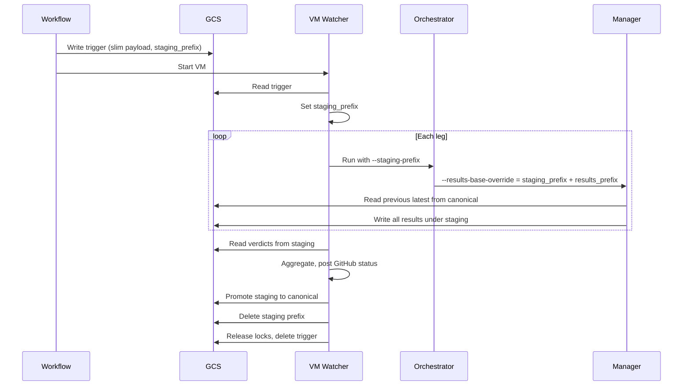

# Temp Results, Atomic Promotion, Slim Payload, and Test Plan

## 1. Requirements

### 1.1 Functional

- **Temp-only during run:** All result JSONs (and related artifacts) produced by each project/leg must be written to a **task-local staging area** only (e.g. `results/.pending/<workflow_run_id>/...`). No writes to canonical result paths (e.g. `sk/results/false_rejects/latest.json`, `ci_verdicts/<run_id>.json`) until the full task completes.
- **Atomic promotion on full task completion:** Only when **all** legs of the task have finished (success or failure, as defined) does the VM **promote** staging → canonical: one logical step that makes all result files visible under canonical paths. Promotion must be **atomic per file** (no partial writes visible to readers).
- **No promotion on cancel/supersede:** If the task is abandoned (e.g. newer push for same ref), do **not** promote. Staging can be deleted; canonical must remain unchanged so "task A" never overwrites with irrelevant data.
- **Single active run per ref (optional but recommended):** When a newer trigger arrives for the same repo+ref, the in-flight task can be cancelled (abort legs, skip promotion, process newest). Ensures only the latest run updates canonical state.
- **Gate and aggregation:** Gate comparison (e.g. reading `latest.json` for previous score) must still read from **canonical** when computing the new result; new outputs are written only to **staging** until promotion.

### 1.2 Non-functional

- **I/O:** Minimize overhead: batch listing/copy for promotion, use GCS copy (server-side) instead of download+upload where possible, avoid duplicate reads of verdicts (read once from staging for aggregation then promote).
- **Trigger payload size:** Keep the workflow → VM trigger payload slim. Use short keys and/or IDs; avoid repeating long strings (e.g. resolve `results_prefix` and `verdict_uri` on the VM from project/bmt_id and a single staging prefix).
- **Testability:** Add a test plan (unit + integration) so temp vs canonical behavior and promotion are verified.

### 1.3 Previously out-of-scope: validation and in-scope decision

The following were initially marked out of scope. **Validation is part of this plan** to determine conflicts and whether each belongs in scope.

- **Pub/Sub trigger:** Re-evaluate relevance and compatibility with temp results + atomic promotion (see Section 7). If no conflicts, Pub/Sub may be **in-scope** (same payload contract, same VM flow; staging/promotion is trigger-agnostic).
- **Check Run / PR comment:** Validate that their design does not assume canonical verdict paths or canonical result files **before** promotion. If they only consume verdict data after the task completes (or read from staging for the run summary), there is no conflict; otherwise this plan must constrain when Check Run / PR comment run (e.g. after promotion). Validation outcome may leave them in a separate implementation track but with documented constraints.

**Deliverable:** A short validation section (Section 7) that (1) confirms or revises in-scope vs out-of-scope for Pub/Sub and for Check Run/PR comment, and (2) records any constraints or sequencing requirements to avoid conflicts.

---

## 2. Current state (relevant parts)

- **Trigger payload** ([.github/scripts/ci/commands/run_trigger.py](.github/scripts/ci/commands/run_trigger.py)): Builds `run_payload` with `workflow_run_id`, `repository`, `sha`, `ref`, `run_context`, `bucket`, `bucket_prefix`, `legs[]`. Each leg has `project`, `bmt_id`, `run_id`, `results_prefix`, `verdict_uri`, `triggered_at`. Full URIs and long prefixes are sent.
- **VM watcher** ([remote/vm_watcher.py](remote/vm_watcher.py)): Reads trigger, runs orchestrator per leg in sequence, aggregates verdicts by downloading from `verdict_uri`, posts status, releases locks, deletes trigger. No staging; verdict URIs point at canonical paths.
- **Orchestrator** ([remote/root_orchestrator.py](remote/root_orchestrator.py)): Invokes manager with `--bucket`, `--bucket-prefix`, `--project`, `--bmt-id`, `--run-id`, etc. Does not pass any staging or override for results paths.
- **SK manager** ([remote/sk/bmt_manager.py](remote/sk/bmt_manager.py)): Reads `results_prefix` (and related prefixes) from jobs config; writes `latest.json`, archive, `last_passing.json`, `ci_verdicts/<run_id>.json`, sentinel, logs directly to GCS under `bucket_root + results_prefix`. Reads previous `latest.json` from GCS for gate. All uploads go to canonical today.

---

## 3. Phases and tasks

### Phase 1: Staging layout and contract

**Goal:** Define staging layout and how the VM will know to write to staging and when to promote.

- **Task 1.1** Define staging prefix convention: `results/.pending/<workflow_run_id>/`. Canonical results live under `results/<project>/...` (e.g. `sk/results/false_rejects/`); staging for that leg is `results/.pending/<workflow_run_id>/<canonical_results_prefix>/` (same relative path under `.pending/<workflow_run_id>/`).
- **Task 1.2** Document the contract: (1) Trigger includes `staging_prefix` (e.g. `results/.pending/<workflow_run_id>`). (2) Each leg’s effective results base is `staging_prefix + "/" + canonical_results_prefix`. (3) Promotion: copy every object under `staging_prefix` to the canonical path (strip the `.pending/<workflow_run_id>` prefix); then delete the staging prefix. (4) If task is cancelled, delete staging prefix only; no promotion.
- **Task 1.3** Add a helper in CI (e.g. in [.github/scripts/ci/models.py](.github/scripts/ci/models.py)) to build `staging_prefix` from `workflow_run_id` and optional bucket_prefix (e.g. `results/.pending/<workflow_run_id>` or `<bucket_prefix>/results/.pending/<workflow_run_id>` if prefix is used).
- **Task 1.4** Document that the trigger payload and VM processing are **trigger-source agnostic**: the same payload shape (including `staging_prefix`) and the same staging/promotion flow apply whether the trigger is delivered via GCS (watcher polling) or Pub/Sub (puller). This keeps Pub/Sub in-scope without blocking; a future Pub/Sub path will reuse the same `process_run_payload`-style flow.

---

### Phase 2: Manager and orchestrator support staging

**Goal:** Manager writes to a configurable results base (staging or canonical); orchestrator passes staging when present.

- **Task 2.1** In [remote/sk/bmt_manager.py](remote/sk/bmt_manager.py): Add optional CLI argument `--results-base-override`. When set, use it as the effective results (and archive/logs) base instead of `results_prefix` from config for **all GCS uploads** (latest.json, archive, last_passing, ci_verdicts, sentinel, logs). Gate **read** of previous `latest.json` stays from **canonical** `results_prefix` (so we compare against last promoted run). Internal structure under the override mirrors canonical (e.g. `override/latest.json`, `override/ci_verdicts/<run_id>.json`). No change to local workspace paths (results_dir, archive_dir, logs_dir remain under run_root).
- **Task 2.2** In [remote/root_orchestrator.py](remote/root_orchestrator.py): Add optional `--staging-prefix`. If provided, for the single leg, compute effective results base as `staging_prefix + "/" + canonical_results_prefix` (orchestrator already has project/bmt_id and can load jobs config to get `paths.results_prefix`). Pass this as `--results-base-override` to the manager. If `--staging-prefix` is not set, behavior is unchanged (manager uses config results_prefix).
- **Task 2.3** Ensure manager writes sentinel and ci_verdict under the override path as well, so the watcher can find verdicts under staging for aggregation (verdict URI becomes `bucket_root + "/" + effective_results_base + "/ci_verdicts/" + run_id + ".json"`).

---

### Phase 3: Watcher: drive staging and promotion

**Goal:** Watcher passes staging to orchestrator; after all legs, aggregate from staging then promote atomically; on cancel, skip promotion and delete staging.

- **Task 3.1** In [remote/vm_watcher.py](remote/vm_watcher.py): When building the per-leg trigger for the orchestrator, add `staging_prefix` from the run payload (e.g. `results/.pending/<workflow_run_id>`). Orchestrator must accept and forward this (root_orchestrator already receives args from watcher’s subprocess call; add `--staging-prefix` to the command line when present).
- **Task 3.2** Verdict aggregation: Today the watcher uses `leg["verdict_uri"]` from the trigger. With staging, verdict URIs must point at staging. So either (a) trigger includes per-leg verdict URI under staging (CI builds it from staging_prefix + results_prefix + "/ci_verdicts/" + run_id), or (b) VM builds verdict URI from staging_prefix + resolved results_prefix + run_id. Prefer (b) if we move to slim payload (Phase 5); for now (a) is fine. Ensure _aggregate_verdicts reads from staging URIs when staging_prefix is set.
- **Task 3.3** After all legs complete (and before releasing locks / deleting trigger): if staging_prefix is set, run **promotion**: list all objects under `gs://bucket/<staging_prefix>/` (and bucket_prefix if used); for each object, copy to canonical path (destination = same path with `.pending/<workflow_run_id>` removed); then delete the staging prefix tree. Use `gcloud storage cp` (copy) or GCS JSON API copy so it’s server-side. Implement as a small function in vm_watcher or a helper script called by the watcher.
- **Task 3.4** On cancel/supersede (if implemented): when aborting the run, delete the staging prefix only; do not call promotion.
- **Task 3.5** Locking: Keep existing `.lock` under canonical results_prefix if needed. During the run, no canonical writes so no lock conflict; promotion writes to canonical once at the end. Optionally take a lock per results_prefix during promotion to avoid overlapping promotions from different runs (unlikely if one VM handles one trigger at a time).

---

### Phase 4: I/O optimization

**Goal:** Minimize list/copy round-trips and duplicate reads.

- **Task 4.1** Promotion: List once with a single `gcloud storage ls --recursive gs://bucket/<staging_prefix>` (or equivalent). Build list of (src_uri, dest_uri) pairs; then run copies (parallel or sequential). Prefer one list, then batch copy, then one delete of the prefix (or delete per object after copy).
- **Task 4.2** Avoid double read of verdicts: Aggregate verdicts by reading each leg’s verdict from staging once; use that in-memory result for both (a) computing aggregate status/description and (b) deciding whether to promote. Do not re-read after promotion for aggregation (already done).
- **Task 4.3** Use GCS server-side copy (e.g. `gcloud storage cp gs://src gs://dst` or compose) for promotion so data does not flow through the VM. Reduces network and CPU on the VM.

---

### Phase 5: Slim trigger payload

**Goal:** Reduce payload size by using short keys and resolving long values on the VM.

- **Task 5.1** Define a **compact trigger schema** (for workflow → VM). Option A: Short keys only, e.g. `w`, `r`, `s`, `ref`, `ctx`, `b`, `bp`, `stg`, `pr`, `l` (legs). Option B: Keep readable keys but omit derivable fields. Recommended: keep keys readable for debuggability; omit derivable fields and use IDs where helpful.
- **Task 5.2** Omit from each leg: `results_prefix`, `verdict_uri`, `triggered_at`. On the VM, resolve `results_prefix` from bucket config (bmt_projects + jobs config) using project and bmt_id. Build verdict_uri as `bucket_root + "/" + staging_prefix + "/" + results_prefix + "/ci_verdicts/" + run_id + ".json"` (when staging) or canonical equivalent. CI trigger command stops writing these in the leg object; VM/orchestrator computes them when processing. This significantly reduces payload (no long URIs per leg).
- **Task 5.3** Optional: Short keys for top-level fields, e.g. `w` for workflow_run_id, `r` for repository, `s` for sha, and a small decoder on the VM. Document the mapping so logs and debugging can expand. If omitted, keep current keys and rely on omitting derivable fields for size reduction.
- **Task 5.4** Backward compatibility: VM should accept both old payload (with verdict_uri and results_prefix per leg) and new payload (without). If verdict_uri present, use it; else compute from staging_prefix + resolved results_prefix + run_id. Allows gradual rollout.

---

### Phase 6: Cancel/supersede and “latest only”

**Goal:** When a newer trigger exists for the same ref, cancel in-flight run and do not promote.

- **Task 6.1** (Optional) Before starting a leg or between legs, check for a newer trigger (e.g. list `triggers/runs/` and compare workflow_run_id or triggered_at; or check for a “cancel” sentinel written by a newer workflow). If newer run exists for same repo+ref, set a flag to skip promotion and optionally abort remaining legs.
- **Task 6.2** If aborted: do not run promotion; delete staging prefix for the current workflow_run_id; post status (e.g. “cancelled” or leave pending) and exit. Document behavior in README/CLAUDE.

---

### Phase 7: Cleanup and lifecycle

**Goal:** Avoid leaving stale staging data and document retention.

- **Task 7.1** On promotion success, delete the staging prefix after copy. On promotion failure (e.g. partial copy), leave staging for debugging or retry; document that a cron or manual job can delete `.pending/`* older than N days.
- **Task 7.2** Optional: GCS lifecycle rule on the bucket to delete objects under `results/.pending/` after 7 days. Document in README.

---

### Phase 8: Testing

**Goal:** Reliable tests for temp behavior, promotion, and payload.

- **Task 8.1** Unit tests (local, no GCS): (1) Build compact trigger payload (slim schema) and parse it on the VM side (or in a test) to resolve results_prefix and verdict_uri. (2) Given a list of (src, dest) pairs, promotion logic produces correct canonical paths from staging paths.
- **Task 8.2** Integration test (with test bucket or emulator): (1) Run a single-leg BMT with staging_prefix set; assert no object appears under canonical results path until promotion; after promotion, canonical has expected files. (2) Run two legs (two projects or two BMTs); after both complete, promote once; assert both legs’ results appear under canonical. (3) Run one leg, then “cancel” (e.g. delete trigger or set cancel flag); assert staging is deleted and canonical unchanged.
- **Task 8.3** Payload size: Generate trigger for N legs with current format vs slim format; assert size reduction (e.g. 30–50% or more when omitting verdict_uri/results_prefix per leg).
- **Task 8.4** Document how to run these tests in README or tests/README (fixtures, env vars, optional GCS bucket).

---

### Phase 9: Validation of out-of-scope topics

**Goal:** Confirm no conflicts and document constraints so Pub/Sub and Check Run / PR comment can proceed without clashing with this plan.

- **Task 9.1** Perform the validation in Section 7: (1) Confirm Pub/Sub is compatible (same payload, same VM flow; staging/promotion trigger-agnostic). (2) Confirm Check Run / PR comment have no conflict provided they run after promotion (or after all legs and aggregate from staging). Record outcome in plan or ADR.
- **Task 9.2** If implementing a shared VM entrypoint (e.g. `process_run_payload(run_payload, workspace_root, github_token)`), ensure it is used by both the GCS watcher and (when added) the Pub/Sub puller so that staging and promotion logic live in one place.
- **Task 9.3** Document the constraint for Check Run / PR comment in CLAUDE or the plan: “Produce Check Run and PR comment only after all legs complete and after promotion (or after aggregate from staging); do not assume canonical result paths are updated before promotion.”

---

## 4. Data flow (high level)

---

## 5. Files to touch (summary)

| Area                       | Files                                                                                                                                                             |
| -------------------------- | ----------------------------------------------------------------------------------------------------------------------------------------------------------------- |
| Staging contract / helpers | [.github/scripts/ci/models.py](.github/scripts/ci/models.py) (staging_prefix helper), docs in README or CLAUDE                                                    |
| Trigger payload            | [.github/scripts/ci/commands/run_trigger.py](.github/scripts/ci/commands/run_trigger.py) (add staging_prefix; optionally omit results_prefix/verdict_uri per leg) |
| Manager                    | [remote/sk/bmt_manager.py](remote/sk/bmt_manager.py) (--results-base-override; write to override path; read previous from canonical)                              |
| Orchestrator               | [remote/root_orchestrator.py](remote/root_orchestrator.py) (--staging-prefix; resolve results_prefix from config; pass override to manager)                       |
| Watcher                    | [remote/vm_watcher.py](remote/vm_watcher.py) (pass staging_prefix; build verdict URIs from staging; promotion step after all legs; optional cancel handling)      |
| Tests                      | New tests under [tests/](tests/) for payload parsing, promotion path mapping, and (if possible) integration with test bucket                                      |
| Docs                       | [README.md](README.md), [CLAUDE.md](CLAUDE.md): staging layout, promotion, slim payload, lifecycle                                                                |

---

## 6. What you may have missed

- **Gate read from canonical:** The manager must continue to read “previous” `latest.json` from the **canonical** path for delta/gate; only **writes** go to staging. This is already implied in Task 2.1 but is critical.
- **last_passing.json:** Same rule: write to staging during run; on promotion, it overwrites canonical. Only promote when the full task completes (so last_passing is consistent with the run we just promoted).
- **Verdict URI in manager summary:** Manager returns `ci_verdict_uri` in its summary; when using override, that URI should point at the staging path so the orchestrator/watcher can pass it or find it. Ensure root_orchestrator and watcher use staging verdict URIs for aggregation when staging is in use.
- **Idempotency of promotion:** If promotion is run twice (e.g. retry), it should be safe: copy overwrites; then delete staging. No duplicate keys.
- **Concurrency:** If two triggers for the same ref run on two VMs (shouldn’t happen if you have “latest only” and one VM), use a lock per (bucket, results_prefix) during promotion to avoid interleaved writes. Single VM handling one trigger at a time avoids this.
- **Logs and archive:** Logs and archive under staging are promoted like result JSONs; same list-and-copy from `.pending/<workflow_run_id>/...` so the full tree is moved.

---

## 7. Validation of “out of scope” topics (conflicts and in-scope)

### 7.1 Pub/Sub trigger — re-evaluation and relevance

**Relevance to this plan:** High. The Pub/Sub trigger replaces **how** the VM receives the run payload (message vs GCS file); it does **not** change **what** the VM does with that payload (run legs, write to staging, aggregate, promote, post status). Staging prefix, promotion, and slim payload are all **trigger-agnostic**: the same `run_payload` (with `staging_prefix`, legs, repo, sha, etc.) can be delivered via GCS trigger file or Pub/Sub message.

**Compatibility:**

- **Payload:** Pub/Sub message body can carry the same JSON (slim or full) as the GCS trigger. Size limit 10 MB is sufficient. No conflict.
- **Staging and promotion:** VM logic “parse payload → run legs with staging_prefix → aggregate from staging → promote” is unchanged whether the payload came from GCS or Pub/Sub. No conflict.
- **Cancel / latest-only:** With Pub/Sub, “newer run for same ref” can be implemented by having the VM nack older messages or skip processing if a newer message has been seen; staging for the older run is never promoted. Complements this plan.
- **Ordering:** Workflow publishes one message per run; VM can process in order or dedupe by `workflow_run_id`. Staging prefix is per `workflow_run_id`, so no collision.

**Conclusion:** Pub/Sub trigger is **compatible** with temp results and atomic promotion. It is **in-scope** in the sense that this plan should **allow for** Pub/Sub: the VM entrypoint that processes a trigger (GCS or Pub/Sub) must receive the same payload shape (including `staging_prefix`) and run the same staging/promotion flow. Implementation of the Pub/Sub path (workflow publish, VM subscriber) can be a separate phase or follow this plan; the design of this plan does not conflict and should explicitly assume that the trigger source may be either GCS or Pub/Sub.

**Recommended:** Add an explicit note in the contract (Phase 1) and in the watcher/puller design that “trigger payload is source-agnostic (GCS or Pub/Sub).” Optionally add a Phase 9 (or fold into Phase 3): “Ensure VM processing path is shared (single `process_run_payload(run_payload, ...)` used by both GCS watcher and Pub/Sub puller).” That keeps Pub/Sub in-scope without blocking this plan.

### 7.2 Check Run / PR comment — conflict check

**Risk:** Check Run and PR comment implementations might assume that verdict files (or `latest.json`) are already in **canonical** locations when they run. In this plan, canonical is updated only **after** promotion (after all legs complete).

**Validation:**

- If Check Run / PR comment run **after** the watcher has finished all legs and **after** promotion, they read from canonical and see the full, final result. **No conflict.**
- If they run **before** promotion (e.g. immediately after each leg), they would read from staging or from canonical (incomplete). To avoid showing partial/irrelevant data, Check Run and PR comment should be updated **once**, after aggregation and **after** promotion, using verdict data the watcher already has in memory (from staging) or from canonical post-promotion. So the constraint is: **post status, create/update Check Run, and post PR comment only after promotion** (or at least after all legs are done and verdicts have been read from staging). That matches the current flow (watcher aggregates, then posts status). No conflict if Check Run and PR comment are implemented in that same place (after all legs, after promotion).

**Conclusion:** No conflict **provided** Check Run and PR comment are produced in the same place and at the same time as the commit status: after all legs complete and after promotion. Document this as a constraint for the Check Run / PR comment implementation. They remain implementable in a separate track; this plan does not need to implement them, but the plan’s sequencing (promotion before “post to GitHub”) must be the single requirement they follow.

### 7.3 Summary

| Topic           | Conflict? | In-scope for this plan?  | Action                                                                                                                                                     |
| --------------- | --------- | ------------------------ | ---------------------------------------------------------------------------------------------------------------------------------------------------------- |
| Pub/Sub trigger | No        | Yes (design compatible)  | Assume trigger source can be GCS or Pub/Sub; shared VM processing path; optional Phase for Pub/Sub implementation or explicit “trigger-agnostic” contract. |
| Check Run / PR  | No        | No (separate impl track) | Constraint: run after promotion (or at least after all legs + aggregate). Document in this plan and in their spec.                                         |

