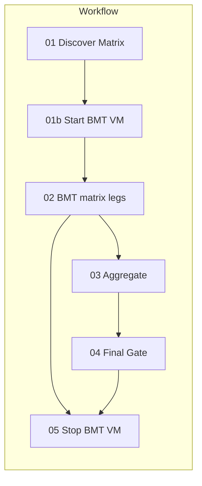

# VM wake and idle for CI

## Goal

- **Wake:** Start the VM only when a run needs it; wait until status is RUNNING before any leg runs.
- **Legs:** Do not assume the VM is up; wait for positive RUNNING (with timeout), then trigger.
- **Idle:** Stop the VM after all BMT work is done to save cost.

## Architecture

- **Start BMT VM** runs after matrix discovery; it starts the instance (if stopped) and polls until RUNNING (bounded timeout). BMT job depends on it.
- **Each leg** (run-leg) calls `wait_for_vm_running()` then `trigger_cloud_bmt()`; if wait times out, leg fails with reason `vm_not_running` and does not SSH.
- **Stop BMT VM** runs after the BMT job completes (`needs: bmt`, `if: always()`); it stops the instance. Step should use `continue-on-error: true` so a failed stop does not change the gate outcome.

## 1. Adapter: VM start, stop, and wait ([.github/scripts/ci/adapters/gcloud_cli.py](.github/scripts/ci/adapters/gcloud_cli.py))

- `**vm_start(vm_name: str, zone: str, project: str) -> bool`**
Run `gcloud compute instances start <vm_name> --zone <zone> --project <project>`. Return success (e.g. via `run_capture`; consider both exit 0 and “already running” as success). Idempotent: no-op if already RUNNING.
- `**wait_for_vm_running(vm_name: str, zone: str, timeout_sec: int = 300, interval_sec: int = 10) -> bool`**
Loop: call existing `vm_is_running(vm_name, zone)` every `interval_sec` until True or `timeout_sec` elapsed. Use `time.monotonic()` for the deadline (same pattern as `_poll_sentinel_uri`). Return True if RUNNING was observed, False on timeout.
- `**vm_stop(vm_name: str, zone: str, project: str) -> tuple[int, str]**`
Run `gcloud compute instances stop <vm_name> --zone <zone> --project <project>`. Return `(returncode, stderr_or_stdout)` so the caller can log and optionally ignore failure.
- `**trigger_cloud_bmt` (behavior change)**
Before the existing “if not vm_is_running: return TRIGGER_FAIL” block:
  - Call `wait_for_vm_running(vm_name, zone, timeout_sec=vm_wait_sec, interval_sec=10)`.
  - Add a `vm_wait_sec: int` parameter (e.g. default 120 or 300).
  - If wait returns False: log `::error::VM not RUNNING within timeout`, return `(models.TRIGGER_FAIL, 1)`. Leg outcome will use existing `REASON_VM_NOT_RUNNING` from [ci/models.py](.github/scripts/ci/models.py) (already defined around line 43).
  - If wait returns True: keep current logic (check orchestrator exists, build remote command, SSH). Remove or keep the immediate `vm_is_running` check after the wait; a single check after wait is enough.

## 2. run-leg: Pass VM wait timeout ([.github/scripts/ci/commands/run_leg.py](.github/scripts/ci/commands/run_leg.py))

- Add CLI option `--vm-wait-sec` (e.g. default `300`, type=int). Document as “Max seconds to wait for VM RUNNING before failing the leg.”
- Pass `vm_wait_sec` into `gcloud_cli.trigger_cloud_bmt(...)` (add the parameter to the adapter signature and use it in `wait_for_vm_running`).

## 3. New ci_driver commands: start-vm and stop-vm

- **start-vm** (new command in a new file under `ci/commands/`, e.g. [.github/scripts/ci/commands/start_vm.py](.github/scripts/ci/commands/start_vm.py))
  - Options: `--vm-name`, `--zone`, `--project` (required for gcloud compute start).
  - Logic: call `gcloud_cli.vm_start(vm_name, zone, project)`; then `gcloud_cli.wait_for_vm_running(vm_name, zone, timeout_sec=300, interval_sec=10)`. Exit 0 if VM is RUNNING, non-zero otherwise (print `::error::` and exit 1 on timeout or start failure).
- **stop-vm** (new command, e.g. [.github/scripts/ci/commands/stop_vm.py](.github/scripts/ci/commands/stop_vm.py))
  - Options: `--vm-name`, `--zone`, `--project`.
  - Logic: call `gcloud_cli.vm_stop(...)`; log return code and output; exit 0 (so the workflow step does not fail the job). Optionally log a warning if stop failed so it’s visible in logs.
- Register both in [.github/scripts/ci_driver.py](.github/scripts/ci_driver.py): `cli.add_command(start_vm_cmd)` and `cli.add_command(stop_vm_cmd)`.

## 4. Workflow changes ([.github/workflows/ci.yml](.github/workflows/ci.yml))

- **Env:** Add `GCP_PROJECT` (e.g. `${{ vars.GCP_PROJECT }}` or `vars.BMT_GCP_PROJECT`) for Compute start/stop. Document in [CLAUDE.md](CLAUDE.md) under GCP Environment Variables.
- **New job: Start BMT VM (01b)**
  - `needs: prepare-matrix`.
  - Same pattern as bmt for checkout, GCP Auth (WIF), Setup Cloud SDK, pip install.
  - Single step: `ci_driver.py start-vm --vm-name "$VM_NAME" --zone "$GCP_ZONE" --project "$GCP_PROJECT"`.
  - No outputs required; BMT job simply depends on this job.
- **BMT job (02)**
  - Change `needs: prepare-matrix` to `needs: [prepare-matrix, start-bmt-vm]` (use the actual job id for the start job).
  - Optionally pass `--vm-wait-sec` to run-leg (e.g. 120) so legs don’t wait too long if the start job already brought the VM up; keep a sensible default (e.g. 300) in the command.
- **New job: Stop BMT VM (05)**
  - `needs: bmt`, `if: always()`.
  - Same auth/setup as other GCP steps.
  - Step: run `ci_driver.py stop-vm --vm-name "$VM_NAME" --zone "$GCP_ZONE" --project "$GCP_PROJECT"`.
  - Set `continue-on-error: true` on this step so a stop failure (e.g. permissions, VM already stopped) does not fail the job or affect the gate.

Job order: 01 → 01b → 02 → 03 → 04; 05 runs after 02 (and can run in parallel with 03/04 or after them; simplest is `needs: bmt` so it runs after all matrix legs).

## 5. Documentation

- [CLAUDE.md](CLAUDE.md): In “GCP Environment Variables (CI)”, add `GCP_PROJECT` (GCP project ID for Compute start/stop). Optionally add one sentence under Architecture that the workflow starts the VM before BMT and stops it after to minimize cost.

## 6. Implementation notes

- **Project:** `gcloud compute instances start|stop` require a project. Using an explicit `GCP_PROJECT` in the workflow keeps behavior consistent across environments.
- **Idempotency:** `vm_start` is idempotent (start when not running is safe; when already RUNNING, gcloud may no-op or return success).
- **Reason code:** Use existing `REASON_VM_NOT_RUNNING` when the leg times out waiting for RUNNING; no new constants needed.
- **Thin wrapper:** YAML stays thin (one new step per new job); VM lifecycle and wait logic live in the existing adapter and new small commands.

## File summary

| File                                                                                   | Change                                                                                                                      |
| -------------------------------------------------------------------------------------- | --------------------------------------------------------------------------------------------------------------------------- |
| [.github/scripts/ci/adapters/gcloud_cli.py](.github/scripts/ci/adapters/gcloud_cli.py) | Add `vm_start`, `vm_stop`, `wait_for_vm_running`; add `vm_wait_sec` to `trigger_cloud_bmt` and call wait before triggering. |
| [.github/scripts/ci/commands/run_leg.py](.github/scripts/ci/commands/run_leg.py)       | Add `--vm-wait-sec`, pass into `trigger_cloud_bmt`.                                                                         |
| [.github/scripts/ci/commands/start_vm.py](.github/scripts/ci/commands/start_vm.py)     | New: start-vm command.                                                                                                      |
| [.github/scripts/ci/commands/stop_vm.py](.github/scripts/ci/commands/stop_vm.py)       | New: stop-vm command.                                                                                                       |
| [.github/scripts/ci_driver.py](.github/scripts/ci_driver.py)                           | Register start_vm and stop_vm commands.                                                                                     |
| [.github/workflows/ci.yml](.github/workflows/ci.yml)                                   | Add `GCP_PROJECT`; add job Start BMT VM; bmt needs start job; add job Stop BMT VM with continue-on-error.                   |
| [CLAUDE.md](CLAUDE.md)                                                                 | Document `GCP_PROJECT`; optional sentence on VM lifecycle.                                                                  |

