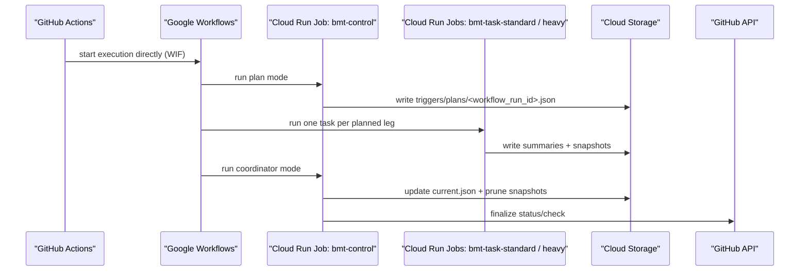

# Architecture

## Production pipeline

## Runtime contract

The active runtime is [`/home/yanai/sandbox/bmt-gcloud/gcp/image/bmt`](/home/yanai/sandbox/bmt-gcloud/gcp/image/bmt).

- `plan` reads enabled manifests and writes `triggers/plans/<workflow_run_id>.json`
- `task` reads the frozen plan and executes exactly one leg selected by `CLOUD_RUN_TASK_INDEX`
- `coordinator` reads summaries, updates pointers, prunes snapshots, and posts GitHub results
- `dataset-import` expands uploaded archives into `projects/<project>/inputs/<dataset>/`

## Storage model

- bucket root mirrors [`/home/yanai/sandbox/bmt-gcloud/gcp/stage`](/home/yanai/sandbox/bmt-gcloud/gcp/stage)
- published manifests live under `projects/<project>/...`
- immutable plugins live under `projects/<project>/plugins/<plugin>/sha256-<digest>/...`
- datasets live extracted under `projects/<project>/inputs/<dataset>/...`

Canonical runtime artifacts:

- `triggers/plans/<workflow_run_id>.json`
- `triggers/summaries/<workflow_run_id>/<project>-<bmt_slug>.json`
- `projects/<project>/results/<bmt_slug>/snapshots/<run_id>/latest.json`
- `projects/<project>/results/<bmt_slug>/snapshots/<run_id>/ci_verdict.json`
- `projects/<project>/results/<bmt_slug>/current.json`

## Contributor model

- author in [`/home/yanai/sandbox/bmt-gcloud/gcp/stage/projects/<project>/plugin_workspaces`](/home/yanai/sandbox/bmt-gcloud/gcp/stage)
- publish immutable plugin bundles with `just publish-bmt`
- upload datasets with `just upload-data`
- inspect the live bucket with `just mount-project`

The old VM watcher, root orchestrator, and per-project `bmt_manager.py` inheritance stack have been removed from the active codebase. The supported execution path is the direct Workflow -> Cloud Run runtime only.
