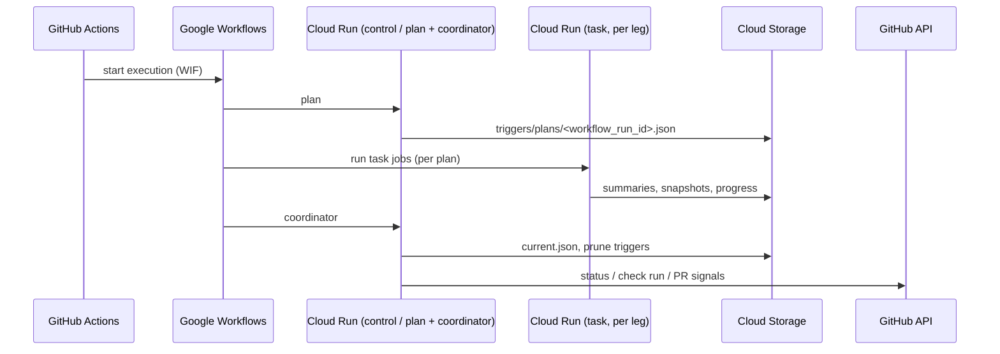

# Architecture

**Production path:** GitHub Actions → Workload Identity Federation → **Google Workflows** → **Cloud Run Jobs** (`plan` → task jobs → `coordinator`). **GCS** mirrors the staged tree under `benchmarks/`; the container image is built from **`backend/`**.

**More detail:** [pipeline-dag.md](pipeline-dag.md) (diagrams + glossary) · [bmt-architecture-deep-dive.md](bmt-architecture-deep-dive.md) (risks, contracts) · [configuration.md](configuration.md) (env, Pulumi)

---

## Production pipeline

---

## Repo ↔ runtime mapping

| Area | Repo path | Deploy / sync |
| --- | --- | --- |
| **Runtime code** | `backend/` | Baked into the Cloud Run image |
| **Stage mirror (bucket root)** | `benchmarks/` | `just sync-to-bucket` / workspace deploy → GCS |
| **CI / handoff CLI** | `ci/` (`bmt-gate`, import `bmtgate`) | Runs in Actions via `uv run bmt …` |

### Plugin SDK vs stage tree

- **Image (`backend/`, including runtime SDK):** stable types and helpers; changing it needs a **new image**.
- **Stage (`benchmarks/`):** per-project plugins, `bmt.json`, inputs, runner binaries; sync the **bucket**, not necessarily rebuild the image. See [ADR 0004](adr/0004-plugin-sdk-boundary.md).

**Runtime modes (conceptual):**

- `plan` — enabled manifests → frozen plan JSON on GCS.
- `task` — one leg per invocation (`CLOUD_RUN_TASK_INDEX` + profile).
- `coordinator` — merge leg outcomes, update `current.json`, finalize GitHub, delete ephemeral `triggers/*` for the run.
- `dataset-import` — expand archives under `projects/<project>/inputs/<dataset>/`.

---

## Storage model (GCS)

Bucket root mirrors **`benchmarks/`**.

**Persistent (under `projects/`):**

- Manifests: `projects/<project>/bmts/<benchmark>/bmt.json` (folder name = `bmt_slug`).
- Plugins: `projects/<project>/plugins/<plugin>/sha256-<digest>/…`
- Inputs: `projects/<project>/inputs/<dataset>/…`
- Results: `projects/<project>/results/<benchmark>/current.json`, `snapshots/<run_id>/…`

**Ephemeral (`triggers/`, deleted after successful coordinator):**

- `triggers/plans/<workflow_run_id>.json`
- `triggers/summaries/<workflow_run_id>/…`
- `triggers/progress/…`, `triggers/reporting/…` (check run metadata)

**Baseline / gating:** each **task** evaluates against the prior **`last_passing`** snapshot (via `current.json`). The **coordinator** updates pointers and prunes; it does not re-score legs.

---

## Workflow execution order (mental model)

Google Workflows runs **plan → task stage → coordinator**. Task work is **one leg per Cloud Run task invocation**; **standard** and **heavy** profiles are orchestrated **sequentially** by the workflow (not two simultaneous job families). For a step-level map aligned to YAML, see [ROADMAP.md](../ROADMAP.md) (workflow readability backlog).

---

## Contributor flow (local)

Author under `benchmarks/projects/…`, publish plugins, sync bucket. Commands and recipes: [contributor-commands.md](contributor-commands.md), [CONTRIBUTING.md](../CONTRIBUTING.md).

The legacy VM watcher / monolithic orchestrator path is **not** supported; production is Workflows + Cloud Run only.
