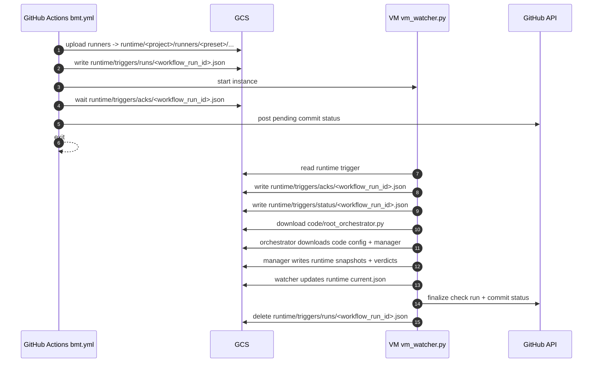
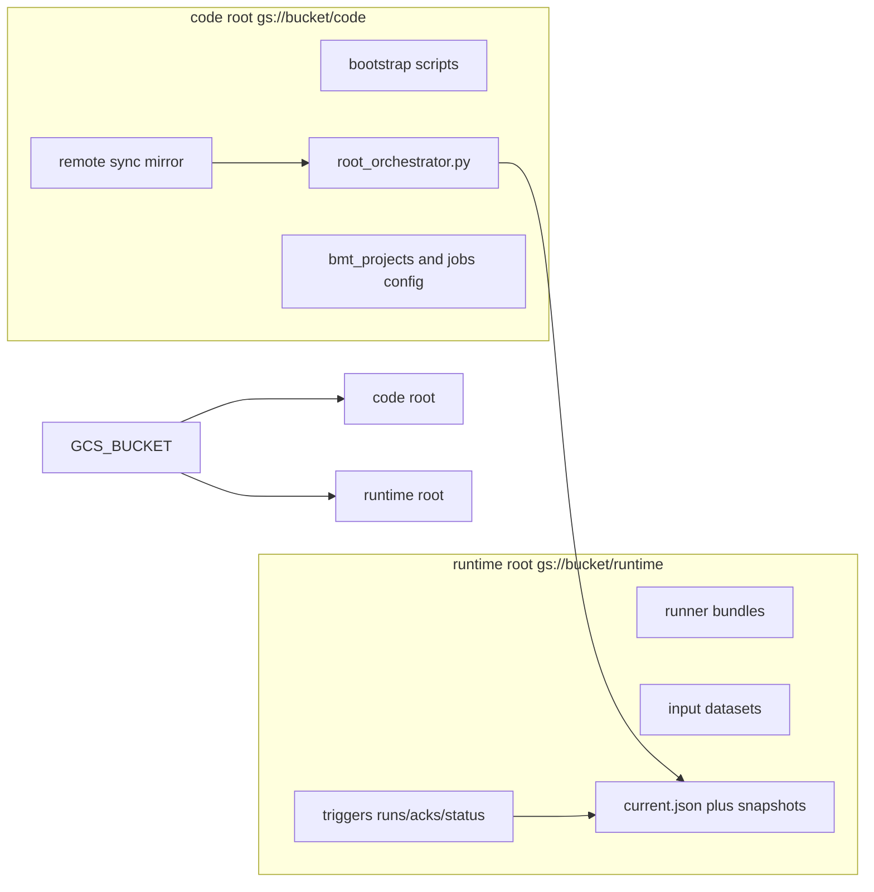
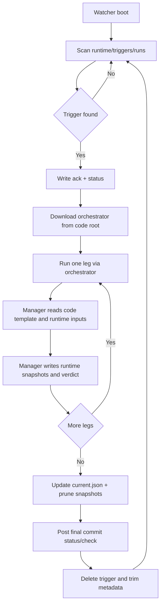

# Architecture

Current architecture is trigger-and-stop with explicit storage split. See [implementation.md](implementation.md) for data flow, reliability behavior, and "not implemented" items.

- `dummy-build-and-test.yml` builds and dispatches `bmt.yml`
- `bmt.yml` uploads runtime artifacts, writes run trigger, starts VM, waits for handshake, exits
- VM watcher processes legs asynchronously and posts final status/check

## Diagrams

### End-to-end sequence

### Namespace split

### VM execution flow

## Namespace model

Fixed roots (no parent prefix):

- `code_root = gs://<bucket>/code`
- `runtime_root = gs://<bucket>/runtime`

Separation rules:

1. `remote/code` sync writes only to `code_root`.
2. Triggers, status, runners, datasets, outputs, results write only to `runtime_root`.
3. Watcher and monitor must resolve identical runtime URIs.
4. `remote/` remains a 1:1 local bucket mirror with only `code/` and `runtime/` at top level.

## End-to-end flow

1. CI uploads runner bundle to `runtime_root/<project>/runners/<preset>/...`.
2. CI writes trigger: `runtime_root/triggers/runs/<workflow_run_id>.json`.
3. CI starts VM and waits for `runtime_root/triggers/acks/<workflow_run_id>.json`.
4. VM watcher reads trigger, writes ack/status under runtime root.
5. Watcher downloads orchestrator from code root.
6. Orchestrator downloads project config/manager from code root.
7. Manager reads template from code root and runner/dataset from runtime root.
8. Manager writes snapshot artifacts under runtime root.
9. Watcher updates `current.json`, prunes stale snapshots, posts final GitHub status/check run.

## Script map

### CI

| File | Role |
|---|---|
| `.github/scripts/ci/models.py` | Fixed code/runtime root URI helpers. |
| `.github/scripts/ci/commands/run_trigger.py` | Trigger payload + runtime trigger write. |
| `.github/scripts/ci/commands/start_vm.py` | Start + readiness verification. |
| `.github/scripts/ci/commands/wait_handshake.py` | Handshake wait + diagnostics + reason codes. |
| `.github/scripts/ci/commands/upload_runner.py` | Runtime runner upload. |
| `.github/scripts/ci/commands/sync_vm_metadata.py` | Sync `GCS_BUCKET` and `BMT_REPO_ROOT` metadata. |

### VM

| File | Role |
|---|---|
| `remote/code/vm_watcher.py` | Trigger polling, leg orchestration, status/check publishing, pointer promotion. |
| `remote/code/root_orchestrator.py` | Fetch code-root assets and run per-leg manager. |
| `remote/code/sk/bmt_manager.py` | Run runner and upload canonical snapshot artifacts. |
| `remote/code/lib/status_file.py` | Runtime-prefix-aware status heartbeat/progress operations. |

### Devtools

| File | Role |
|---|---|
| `devtools/bucket_sync_remote.py` | Manual code-root sync + manifest write. |
| `devtools/bucket_verify_remote_sync.py` | Verify local `remote/code` digest vs uploaded code manifest. |
| `devtools/bucket_upload_runner.py` | Runtime runner upload helper. |
| `devtools/bucket_upload_wavs.py` | Runtime dataset upload helper. |
| `devtools/bucket_validate_contract.py` | Validate split contract (code + runtime canonical objects). |
| `devtools/bmt_monitor.py` | Runtime-prefix-aware live monitor. |

## Trigger payload contract

Required fields:

- `workflow_run_id`
- `repository`
- `sha`
- `ref`
- `run_context`
- `triggered_at`
- `bucket`
- `legs[]`

## VM bootstrap contract

- VM metadata contains `GCS_BUCKET`, `BMT_REPO_ROOT`
- Workflow sync step writes inline `startup-script` from `remote/code/bootstrap/startup_wrapper.sh`
- Wrapper syncs strictly from `code_root` and runs `bootstrap/startup_example.sh`
- Startup resolves `uv` in this order: `BMT_UV_BIN` override, `uv` on PATH, pinned artifact `<code-root>/_tools/uv/linux-x86_64/uv` verified by `<code-root>/_tools/uv/linux-x86_64/uv.sha256`
- Dependency install contract is code-root `pyproject.toml` + `uv.lock` (`bootstrap/install_deps.sh` uses `uv sync --extra vm --frozen`)
- `startup-script-url` mode remains optional for manual setup/cutover

Rollback path: `remote/code/bootstrap/rollback_vm_startup_to_inline.sh`

## Workspace contract

Default workspace path is `~/bmt_workspace`.
Compatibility fallback:

- if `BMT_WORKSPACE_ROOT` / `--workspace-root` not set
- and legacy `~/sk_runtime` exists while `~/bmt_workspace` does not
- use `~/sk_runtime` with warning

## Results contract

Canonical source of truth:

- `<runtime-root>/<results_prefix>/current.json`
- `<runtime-root>/<results_prefix>/snapshots/<run_id>/latest.json`
- `<runtime-root>/<results_prefix>/snapshots/<run_id>/ci_verdict.json`

Legacy root-level `latest.json`/`last_passing.json` are no longer required by the validator.
