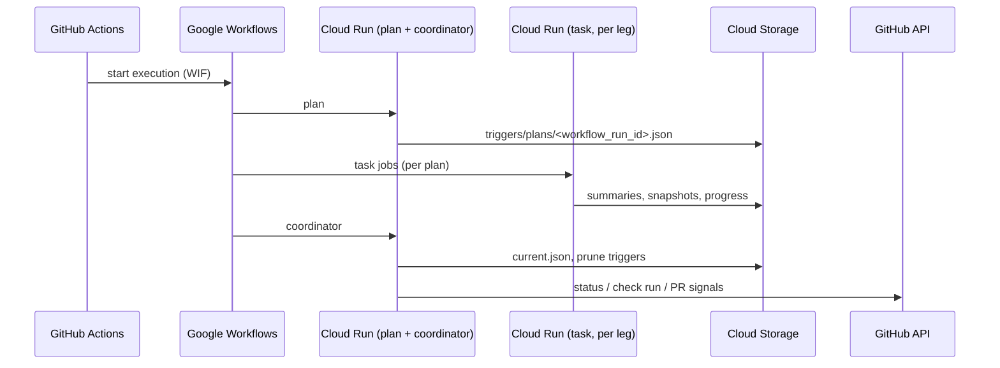
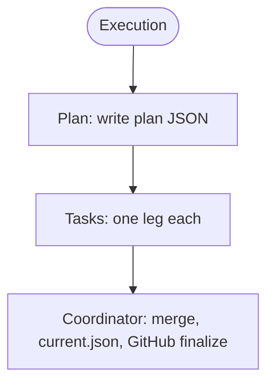

# Architecture

**Purpose:** **Explanation** — design of the BMT Cloud Run pipeline, storage contracts, and major trade-offs. **Not** day-to-day setup ([CONTRIBUTING.md](../CONTRIBUTING.md)) or infra apply steps ([infrastructure.md](infrastructure.md)).

## Diagrams: where they live

- **Prefer** one or two **Mermaid blocks in this file** for the diagrams readers need most often (GitHub renders them inline).
- **Optional:** extra diagrams as `docs/diagrams/<name>.md` (each file is mostly a fenced `mermaid` block so GitHub renders it). Raw `.mmd` / `.mermaid` sources are optional for editors; **`.md` is the portable preview** in the repo.
- **Avoid** duplicating the same diagram in two places; link from here to a `diagrams/` page when a figure grows large or is reused.

---

## Design choices (summary)

- **Orchestration:** GitHub Actions starts **Google Workflows**; **Cloud Run Jobs** run `plan` → per-leg **task** jobs → **coordinator**. No legacy VM loop.
- **Coordination plane:** **GCS** mirrors **`benchmarks/`**. Ephemeral **`triggers/`** (plans, summaries, reporting) vs persistent **`projects/…`** (configs, results, snapshots).
- **CI package:** **`kardome-bmt-gate`** (`ci/`, import **`bmtgate`**) dispatches and handshakes; **zero imports from `backend.*`**.
- **Runtime:** **`backend/`** is image-baked; project plugins and datasets live under **`benchmarks/`** and sync separately.

---

## Production sequence

---

## Logical flow (plan → tasks → coordinator)

**Gating:** per-task **evaluate** uses **`last_passing`** from `current.json`. The coordinator updates pointers; it does not re-score legs.

---

## Repo ↔ deploy surfaces

| Surface | Path | Notes |
| --- | --- | --- |
| Runtime image | `backend/` | Cloud Run |
| Stage mirror | `benchmarks/` | `just sync-to-bucket` / `just workspace deploy` |
| Handoff CLI | `ci/src/bmtgate/` | `uv run bmt …` |

Top-level tree: [README.md](../README.md).

**Modes:** `plan` | `task` | `coordinator` | `dataset-import`.

---

## Storage model (GCS)

Root mirrors **`benchmarks/`**.

**Persistent:** `projects/<project>/bmts/<benchmark>/bmt.json`, `plugins/…`, `inputs/…`, `results/<benchmark>/current.json` and `snapshots/<run_id>/…`

**Ephemeral** (cleaned by coordinator after every run): `triggers/plans/`, `triggers/summaries/`, `triggers/progress/`, `triggers/reporting/`.

**Detailed diagram — who writes what, ephemeral vs durable, what to look at with a `workflow_run_id`:** [diagrams/gcs-storage.md](diagrams/gcs-storage.md)

---

## Glossary

| Term | Meaning |
| --- | --- |
| **runner** | Native binary that runs audio tests |
| **plugin** | Project Python package implementing **`BmtPlugin`** |
| **leg** | One project + one BMT config |
| **`<benchmark>`** | Folder under `bmts/`; **`bmt_slug`** in `bmt.json` |
| **snapshot** | Outputs for one run |
| **baseline** | Last successful snapshot for comparison (see ADR table) |
| **run_id** | GitHub Actions workflow run id for this execution |

---

## Maintainer: risks & weak points (index)

GCS is not transactional — rely on workflow ordering, deterministic keys, idempotent writers. Handoff **`cancel-in-progress`** can interrupt uploads.

**High level:** duplicate **`results_path`** across legs (pointer corruption); missing summary vs runner failure conflation; GitHub finalize vs GCS truth; single-shot Workflows HTTP calls.

**Long form:** [weak-points-remediation.md](weak-points-remediation.md) (versioned backlog; ephemeral todos live under `docs/plans/` locally, gitignored).

---

## Architecture decisions (ADR summaries)

Former **`docs/adr/*.md`** prose lives in git history if needed.

| # | Decision |
| --- | --- |
| **0001** | **Google Workflows + Cloud Run Jobs** as production orchestration. |
| **0002** | **GCS** (mirror of `benchmarks/`) as coordination plane: ephemeral `triggers/`, persistent `projects/…/results/`. |
| **0003** | **`ScorePayload.extra`**: namespaced keys; respect Checks output limits. |
| **0004** | **SDK boundary:** `backend.runtime.sdk` in image; stage data = `benchmarks/` → sync. |
| **0005** | **`baseline`:** still **`None`** in plugin `execute` until explicitly changed. |
| **0006** | **`plugin.json` `api_version`** must match **`SUPPORTED_PLUGIN_API_VERSIONS`** in the running image. |

Plugin reference: [contributors.md](contributors.md).
