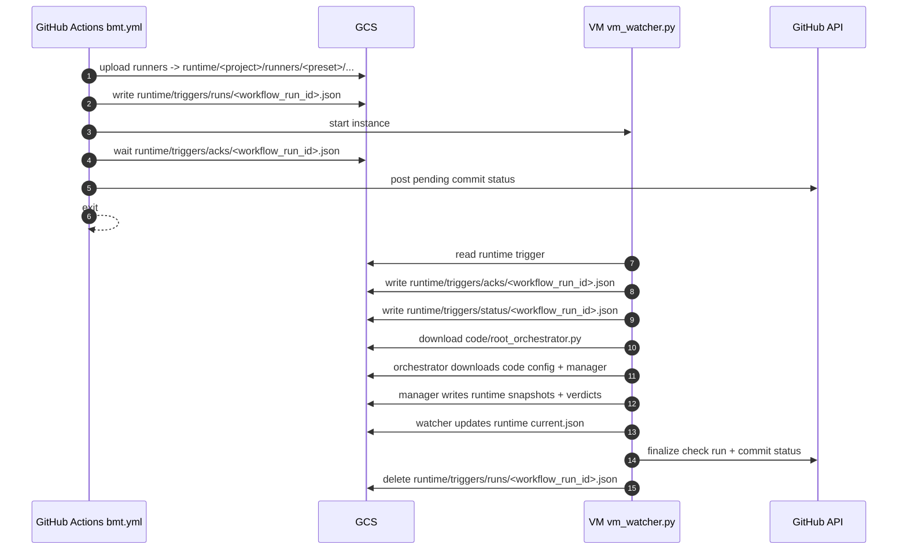
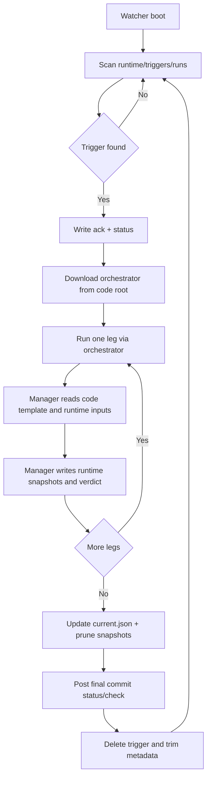

# Architecture

Current architecture is trigger-and-stop with explicit storage split.

- `dummy-build-and-test.yml` builds and dispatches `bmt.yml`
- `bmt.yml` uploads runtime artifacts, writes run trigger, starts VM, waits for handshake, exits
- VM watcher processes legs asynchronously and posts final status/check

## Diagrams

### End-to-end sequence

### Namespace split

### VM execution flow

## Namespace model

Fixed roots (no parent prefix):

- `code_root = gs://<bucket>/code`
- `runtime_root = gs://<bucket>/runtime`

Separation rules:

1. `gcp/code` sync writes only to `code_root`.
2. Triggers, status, runners, datasets, outputs, results write only to `runtime_root`.
3. Watcher and monitor must resolve identical runtime URIs.
4. `gcp/` remains a 1:1 local bucket mirror with only `code/` and `runtime/` at top level.

## Production surface

What must match production when this repo is used as the source for CI and the bucket:

| Artifact | Description |
| ---------- | ------------- |
| **Workflow files** | `.github/workflows/bmt.yml`, `.github/workflows/build-and-test.yml` (when present), `.github/workflows/dummy-build-and-test.yml` (bmt-gcloud test workflow). |
| **Composite actions** | All `.github/actions/` that run the CLI or setup: bmt-prepare, bmt-classify-handoff, bmt-handoff-run, bmt-write-summary, bmt-failure-fallback, bmt-job-setup; checkout-and-restore, restore-snapshot, setup-build-env, setup-gcp-uv. |
| **.github/bmt** | BMT CLI used by workflows (`UV_PROJECT=.github/bmt uv run bmt <cmd>`). |
| **gcp/code/** | Layout synced to `gs://<bucket>/code`: bootstrap, root_orchestrator.py, vm_watcher.py, lib/, sk/, config. |
| **GCS layout** | `code/` and `runtime/` roots; triggers, acks, status, snapshots, current.json under runtime. |
| **VM bootstrap** | Startup script, uv artifact, install_deps contract; branch-protection status context (e.g. `BMT_STATUS_CONTEXT`). |

**Dev-only (not deployed):** `tools/`, Justfile, `tests/`, optional local overrides, `.local/`. `.github/` is aligned with core-main (Python CLI only). Repo vars contract: `tools/repo_vars_contract.py`.

## End-to-end flow

1. CI uploads runner bundle to `runtime_root/<project>/runners/<preset>/...`.
2. CI writes trigger: `runtime_root/triggers/runs/<workflow_run_id>.json`.
3. CI starts VM and waits for `runtime_root/triggers/acks/<workflow_run_id>.json`.
4. VM watcher reads trigger, writes ack/status under runtime root.
5. Watcher downloads orchestrator from code root.
6. Orchestrator downloads project config/manager from code root.
7. Manager reads template from code root and runner/dataset from runtime root.
8. Manager writes snapshot artifacts under runtime root.
9. Watcher updates `current.json`, prunes stale snapshots, posts final GitHub status/check run.

## Script map

### CI

| File | Role |
| --- | --- |
| `.github/scripts/ci/models.py` | Fixed code/runtime root URI helpers. |
| `.github/scripts/ci/commands/run_trigger.py` | Trigger payload + runtime trigger write. |
| `.github/scripts/ci/commands/start_vm.py` | Start + readiness verification. |
| `.github/scripts/ci/commands/wait_handshake.py` | Handshake wait + diagnostics + reason codes. |
| `.github/scripts/ci/commands/upload_runner.py` | Runtime runner upload. |
| `.github/scripts/ci/commands/sync_vm_metadata.py` | Sync `GCS_BUCKET` and `BMT_REPO_ROOT` metadata. |

### VM

| File | Role |
| --- | --- |
| `gcp/code/vm_watcher.py` | Trigger polling, leg orchestration, status/check publishing, pointer promotion. |
| `gcp/code/root_orchestrator.py` | Fetch code-root assets and run per-leg manager. |
| `gcp/code/sk/bmt_manager.py` | Run runner and upload canonical snapshot artifacts. |
| `gcp/code/lib/status_file.py` | Runtime-prefix-aware status heartbeat/progress operations. |

### Tools

| File | Role |
| --- | --- |
| `tools/bucket_sync_gcp.py` | Manual code-root sync + manifest write. |
| `tools/bucket_verify_gcp_sync.py` | Verify local `gcp/code` digest vs uploaded code manifest. |
| `tools/bucket_upload_runner.py` | Runtime runner upload helper. |
| `tools/bucket_upload_wavs.py` | Runtime dataset upload helper. |
| `tools/bucket_validate_contract.py` | Validate split contract (code + runtime canonical objects). |
| `tools/bmt_monitor.py` | Runtime-prefix-aware live monitor. |

## Trigger payload contract

Required fields:

- `workflow_run_id`
- `repository`
- `sha`
- `ref`
- `run_context`
- `triggered_at`
- `bucket`
- `legs[]`

## VM bootstrap contract

- VM metadata contains `GCS_BUCKET`, `BMT_REPO_ROOT`
- Workflow sync step writes inline `startup-script` from packaged resource `cli.resources/startup_entrypoint.sh`
- Entrypoint runs baked `bootstrap/run_watcher.sh` from local `BMT_REPO_ROOT`
- Startup resolves `uv` in this order: `BMT_UV_BIN` override, `uv` on PATH, pinned artifact `<code-root>/_tools/uv/linux-x86_64/uv` verified by `<code-root>/_tools/uv/linux-x86_64/uv.sha256`
- Dependency install on VM: `bootstrap/install_deps.sh` uses **repo-root** `pyproject.toml` for a fingerprint and `pip` for install (no uv at boot). The code-root `pyproject.toml` + `uv.lock` are the declarative VM contract; see [configuration.md](configuration.md#pyproject-files).
- `startup-script-url` mode remains optional for manual setup/cutover

Rollback path: `gcp/code/bootstrap/rollback_startup_to_inline.sh`

## Workspace contract

Default workspace path is `~/bmt_workspace`.
Compatibility fallback:

- if `BMT_WORKSPACE_ROOT` / `--workspace-root` not set
- and legacy `~/sk_runtime` exists while `~/bmt_workspace` does not
- use `~/sk_runtime` with warning

## Results contract

Canonical source of truth:

- `<runtime-root>/<results_prefix>/current.json`
- `<runtime-root>/<results_prefix>/snapshots/<run_id>/latest.json`
- `<runtime-root>/<results_prefix>/snapshots/<run_id>/ci_verdict.json`

Legacy root-level `latest.json`/`last_passing.json` are no longer required by the validator.

---

## Implementation / data flow

How the system runs today, with the current split storage contract and manual code sync.

**Runtime model**

1. CI uploads runner artifacts to `<runtime-root>` and writes one trigger file to `<runtime-root>/triggers/runs/<workflow_run_id>.json`.
2. CI syncs VM metadata, starts the VM, waits for handshake ack, posts pending commit status, and exits.
3. VM watcher polls runtime triggers, writes ack/status files, runs orchestrator per leg, updates pointers, posts final status/check run, and deletes the trigger.
4. For PR-context runs, watcher checks PR state and head SHA:
   - PR already closed at pickup: writes handshake/status skip metadata and exits without running legs.
   - Trigger SHA != current PR head SHA at pickup: marks run skipped as `superseded_by_new_commit`.
   - PR closes or a newer PR head SHA appears during execution: completes current leg, marks remaining legs skipped, finalizes check/status as cancelled (`check=neutral`, `status=error`), and skips pointer promotion.

**Storage contract**

- `<code-root> = gs://<bucket>/code`
- `<runtime-root> = gs://<bucket>/runtime`

Ownership: `gcp/code` is source of truth for deployable code/config/bootstrap only, manually synced to `<code-root>` (`just sync-gcp && just verify-sync`). `gcp/runtime` is source of truth for runtime seed and is manually synced to `<runtime-root>` (`just sync-runtime-seed`). Runtime artifacts must live under `<runtime-root>` only.

**Data flow**

1. `run_trigger.py` writes trigger payload with `bucket`, `workflow_run_id`, `repository`, `sha`, `legs`, etc.
2. `vm_watcher.py` discovers triggers from runtime root, writes ack/status in runtime root.
3. `vm_watcher.py` downloads `root_orchestrator.py` from code root.
4. `root_orchestrator.py` resolves manager/jobs by convention from code root (`<project>/bmt_manager.py`, `<project>/config/bmt_jobs.json`).
5. `sk/bmt_manager.py`: template from code root; runner + dataset from runtime root; outputs/verdict/logs/current pointer artifacts in runtime root.
6. Watcher updates `current.json` and snapshot retention, then posts final GitHub status/check.

**Canonical runtime object layout**

- `<runtime-root>/triggers/runs/<workflow_run_id>.json`
- `<runtime-root>/triggers/acks/<workflow_run_id>.json` (includes `support_resolution_version`, `requested_legs`, `accepted_legs`, `rejected_legs`, optional `run_disposition`, `skip_reason`, `pr_state`, etc.)
- `<runtime-root>/triggers/status/<workflow_run_id>.json` (includes optional `run_outcome`, `cancel_reason`, `cancelled_at`, `superseded_by_sha`, per-leg `skip_reason`)
- `<runtime-root>/<project>/runners/<preset>/...`
- `<runtime-root>/<results_prefix>/current.json`
- `<runtime-root>/<results_prefix>/snapshots/<run_id>/latest.json`, `ci_verdict.json`, `logs/...`

**Reliability behavior**

- `start-vm` validates post-start readiness, not only start command acceptance.
- `wait-handshake` verifies trigger existence first and reports root-cause categories: `trigger_missing`, `status_path_mismatch`, `vm_not_running`, `ack_unreadable`, `ack_not_written`.
- Workflow cleanup removes current run trigger/ack/status objects on failure.
- Handshake v2 is additive/backward-compatible.
- VM support is authoritative: partial support runs accepted legs only; zero support returns `run_disposition=accepted_but_empty` without orchestrator execution.
- PR closure/head-state handling is fail-open for PR-state API errors.
- PR triggers are queueable; stale-trigger deletion/restart preflight is non-destructive for PR context.

**Not implemented**

- GCP SDK migration (CLI-first is still current).
- Automatic CI code sync to `<code-root>` (manual sync is intentional for now).

---

## Repository structure

- **`.github/workflows/`** — Workflow YAML (bmt.yml, build-and-test.yml, dummy-build-and-test.yml). **`.github/actions/`** — Composite actions only; no Python under `.github/`.
- **`.github/bmt/`** — BMT CLI (Python) used by workflows; run with `UV_PROJECT=.github/bmt uv run bmt <cmd>`. Config under `.github/bmt/config/`.
- **`gcp/code/`** — VM code and config; synced to bucket `code/` root. Project config (e.g. bmt_jobs.json) under `gcp/code/<project>/config/`.
- **`gcp/runtime/`** — Runtime seed (runner placeholders, etc.); synced to bucket `runtime/` root.
- **`tools/`** — Local scripts (sync, upload, validate, monitor, gh/bucket helpers). Not part of production surface.
- **`data/`** — Local wav datasets (uploaded explicitly).
- **`tests/`**, **`docs/`** — Tests and documentation.

Single deploy entrypoint: **`just deploy`** runs `just sync-gcp` then `just verify-sync` to push the deploy surface to the bucket.
