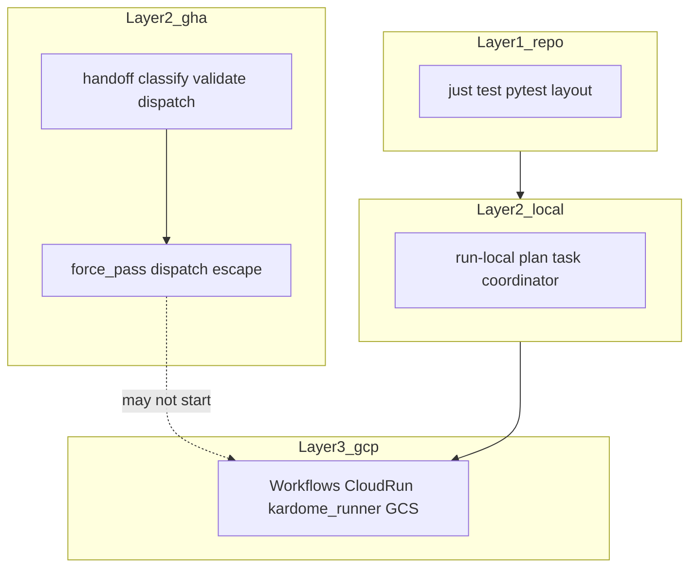

# BMT pipeline signal: three layers, `force_pass`, and release hardening

This page ties together **reproducible tests in this repo**, the **GitHub handoff** job, and **cloud** `kardome_runner` work. Use it when unblocking a release or debugging “flaky BMT.”

## Three layers (what “green” means)

| Layer | What it validates | Reproducible in dev? |
| ----- | ----------------- | -------------------- |
| **1. Repo and CI (bmt-gcloud)** | `just test` (pytest, ruff, `ty check`, actionlint, shellcheck, layout) | Yes — same for every machine with `uv` + `just` |
| **2. Local runtime parity** | `run-local` (plan → task → coordinator) with stage tree; see [developer-workflow.md](developer-workflow.md) | Yes — no Actions/GCP handoff required |
| **3. GitHub + GCP** | Reusable `bmt-handoff.yml`: classify, dataset check, **dispatch** to Google Workflows, then Cloud Run and GCS | Integration — needs WIF, bucket, and a successful **Workflows** start |

**Strong “pipeline stable”** for engineering = Layer 1 always green; Layer 2 for runner/plugin behavior; Layer 3 for production handoff and cloud BMT.



## `force_pass` requires valid dispatch, then short-circuits in cloud runtime

Handoff input **`force_pass: true`** (or env **`BMT_FORCE_PASS` / `KARDOME_BMT_FORCE_PASS`**) still requires a successful Google Workflows dispatch/auth path (`kardome-bmt dispatch invoke-workflow`).

- If dispatch fails (auth/API/network), handoff fails; there is no local dispatch bypass.
- If dispatch succeeds, Cloud Run task legs emit a fast force-pass result (`reason_code=demo_force_pass`) instead of running full BMT execution.
- GitHub App reporting still runs from cloud runtime: Checks tab output, PR comment updates, and passing `BMT Gate` status remain visible.

## Layer 1 and 2 commands (copy-paste)

```bash
# Deterministic pre-push (full suite)
just test

# Unit tests only
uv run python -m pytest tests/ -v
```

```bash
# Local full leg (same runtime as Cloud Run — no Actions)
export BMT_RUNTIME_ROOT="$PWD/gcp/stage"   # or gcp/stage + just deploy
export BMT_ACCEPTED_PROJECTS_JSON='["sk"]'
export BMT_WORKFLOW_RUN_ID="local-dev-1"
uv run --package bmt-runtime python -m runtime.entrypoint run-local local-dev-1 \
  --stage-root "$PWD/gcp/stage"
```

Details: [developer-workflow.md](developer-workflow.md).

## Consuming `bmt-handoff.yml` from another repo (e.g. core-main)

Set these GitHub **Variables** on the **consumer** repo: `GCS_BUCKET`, `GCP_PROJECT`, `GCP_SA_EMAIL`, `GCP_WIF_PROVIDER` (from Pulumi / ops).

Pass **`with:`** on the `workflow_call` job (not repo variables): `cloud_run_region`, `bmt_status_context`, `bmt_pex_repo`, `force_pass`. See [.github/README.md](../.github/README.md) and [configuration.md](configuration.md#infra-and-ci-bmtconfig--repo-vars).

**Minimal shape:**

```yaml
jobs:
  bmt-handoff:
    uses: klugman-yanai/bmt-gcloud/.github/workflows/bmt-handoff.yml@bmt-handoff
    secrets: inherit
    with:
      cloud_run_region: europe-west4
      bmt_status_context: BMT Gate
      bmt_pex_repo: klugman-yanai/bmt-gcloud
      force_pass: false   # true to keep pipeline live while cloud runtime emits force-pass results
```

Pin with `@bmt-vX.Y.Z` for reproducible PEX + workflow behavior.

**Temporary `force_pass: true`:** add a **comment** in the caller (date, owner, revert when dispatch + SK leg are green on `ci/check-bmt-gate`).

## Post-release hardening (checklist)

1. Set **`force_pass: false`** (and clear **`KARDOME_BMT_FORCE_PASS` / `BMT_FORCE_PASS`** if set).
2. Fix **`kardome_runner`** / SK issues in **core-main**; use Layer 2 (`run-local`) and GCS logs per [developer-workflow.md](developer-workflow.md) to verify.
3. Re-run a full **Layer 3** path: handoff → confirmed **`dispatch_confirmed: true`** → Workflows → Cloud Run → **`results/`** and **`current.json`** as expected.
4. Keep **Layer 1** green on every bmt-gcloud change: `just test` before merge to `ci/check-bmt-gate` (see [CLAUDE.md](../CLAUDE.md)).

## Related

- [architecture.md](architecture.md) — end-to-end diagram
- [configuration.md](configuration.md) — env and consumer contract
- [CLAUDE.md](../CLAUDE.md) — `BMT_SKIP_PUBLISH_RUNNERS`, `BMT_RUNNERS_PRESEEDED_IN_GCS`, handoff `force_pass` table
