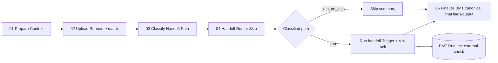

# BMT Gate — Quick Reference

**For:** Developers opening PRs against `core-main`
**Full details:** [bmt-workflow-overview.md](bmt-workflow-overview.md)

---

## What happens when you open a PR?

1. CI automatically triggers a BMT audio regression run
2. You'll see a **"BMT Gate"** check appear on the PR — starts as `pending`
3. A **Check Run** (also in the PR checks tab) shows live progress as tests run
4. When done, the check flips to `success` or `failure`
5. Branch protection requires `success` before merge

You don't need to do anything. Just wait for the result.

---

## How long does it take?

Typically **10–15 minutes** from PR open to final verdict, based on recent run history. Occasionally longer (up to ~50 minutes) if the VM is cold or the run queue is busy. The CI workflow itself exits in under a minute — the VM runs the tests asynchronously and posts the result when done.

---

## Reading the Check Run

Click into **"BMT Gate"** from the PR checks tab:

```
| Project | BMT ID               | Status    | Progress    | Duration |
|---------|----------------------|-----------|-------------|----------|
| sk      | false_reject_namuh   | completed | 47/47 files | 42s      |
```

A `failure` here means the audio scores regressed against the last passing baseline. It is not a flaky test infrastructure issue — it means the code change affected audio quality metrics.

---

## If the gate fails

- Read the Check Run summary for which leg failed and by how much
- Fix the regression in your code and push a new commit — BMT re-runs automatically
- Do **not** disable branch protection or manually override the status unless explicitly told to by the team lead

---

## Monitoring a live run

After the CI workflow hands off, the **GitHub Check Run is the only monitoring option available to most developers.** Click into **"BMT Gate"** from the PR checks tab — it updates in real time with per-leg progress (files processed, status, elapsed time) and finalizes with a summary when done.

The GitHub Actions tab will show the CI workflow as completed (it exits after handoff by design), so it will not reflect the actual BMT test progress.

There is no GCloud Console view available to developers without GCP project access. A live TUI monitor (`devtools/bmt_monitor.py`) exists but requires GCP credentials and bucket access — it is a maintainer/debug tool, not intended for general use.

---

## If the gate is stuck on `pending`

This is rare but can happen if the VM had an issue picking up the run. Options:

1. Wait ~5 minutes — the VM may still be booting
2. Re-trigger the BMT workflow manually: **Actions tab → bmt.yml → Run workflow** on your branch
3. If it still doesn't resolve, ping the team — diagnosing a stuck VM requires GCP access

---

## If you push a new commit while BMT is running

The in-progress run is automatically marked as **superseded**. A new run starts for your latest commit. You don't need to cancel anything manually.

---

## If you close or convert your PR to draft while BMT is running

The in-progress run is cancelled cleanly. No failure is posted. When you re-open the PR, a new run triggers automatically.

---


