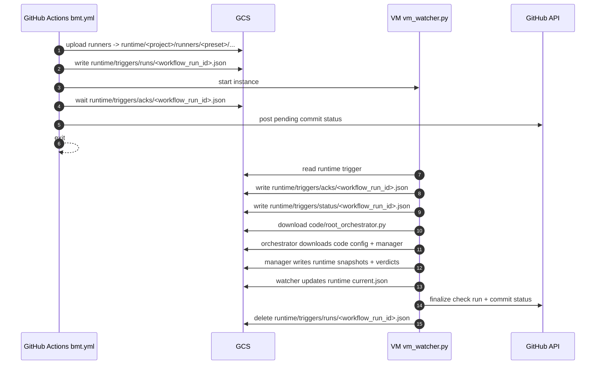
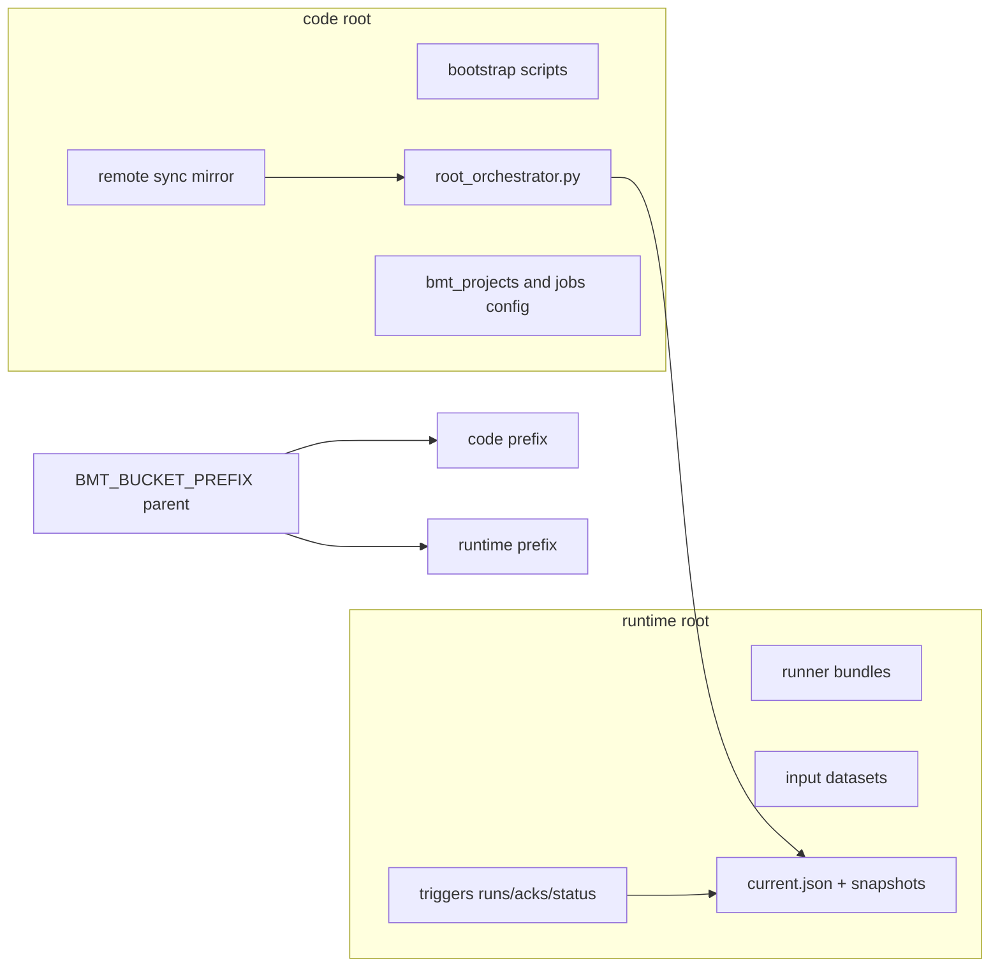
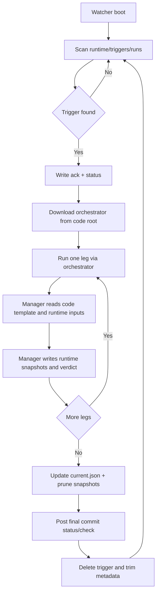

# BMT Diagrams

## End-to-end sequence

```mermaid
sequenceDiagram
    autonumber
    participant CI as GitHub Actions bmt.yml
    participant GCS as GCS
    participant VM as VM vm_watcher.py
    participant GH as GitHub API

    CI->>GCS: upload runners -> runtime/<project>/runners/<preset>/...
    CI->>GCS: write runtime/triggers/runs/<workflow_run_id>.json
    CI->>VM: start instance
    CI->>GCS: wait runtime/triggers/acks/<workflow_run_id>.json
    CI->>GH: post pending commit status
    CI-->>CI: exit

    VM->>GCS: read runtime trigger
    VM->>GCS: write runtime/triggers/acks/<workflow_run_id>.json
    VM->>GCS: write runtime/triggers/status/<workflow_run_id>.json
    VM->>GCS: download code/root_orchestrator.py
    VM->>GCS: orchestrator downloads code config + manager
    VM->>GCS: manager writes runtime snapshots + verdicts
    VM->>GCS: watcher updates runtime current.json
    VM->>GH: finalize check run + commit status
    VM->>GCS: delete runtime/triggers/runs/<workflow_run_id>.json
```

## Namespace split

```mermaid
flowchart LR
    P[BMT_BUCKET_PREFIX parent] --> C[code prefix]
    P --> R[runtime prefix]

    subgraph CodeRoot[code root]
      RC[remote sync mirror]
      BOOT[bootstrap scripts]
      ORCH[root_orchestrator.py]
      CFG[bmt_projects and jobs config]
    end

    subgraph RuntimeRoot[runtime root]
      TRIG[triggers runs/acks/status]
      RUN[runner bundles]
      DATA[input datasets]
      RES[current.json + snapshots]
    end

    RC --> ORCH
    ORCH --> RES
    TRIG --> RES
```

## VM execution flow

```mermaid
flowchart TD
    A[Watcher boot] --> B[Scan runtime/triggers/runs]
    B --> C{Trigger found}
    C -->|No| B
    C -->|Yes| D[Write ack + status]
    D --> E[Download orchestrator from code root]
    E --> F[Run one leg via orchestrator]
    F --> G[Manager reads code template and runtime inputs]
    G --> H[Manager writes runtime snapshots and verdict]
    H --> I{More legs}
    I -->|Yes| F
    I -->|No| J[Update current.json + prune snapshots]
    J --> K[Post final commit status/check]
    K --> L[Delete trigger and trim metadata]
    L --> B
```
