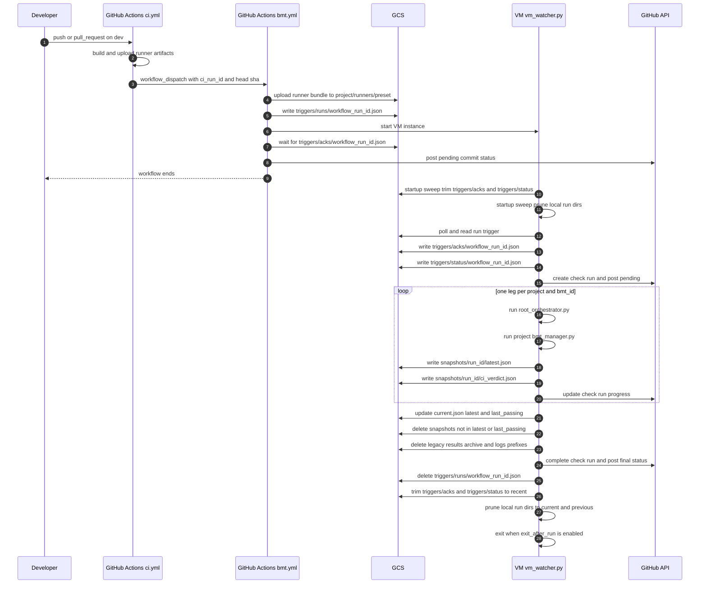
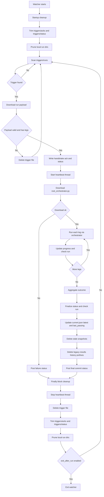
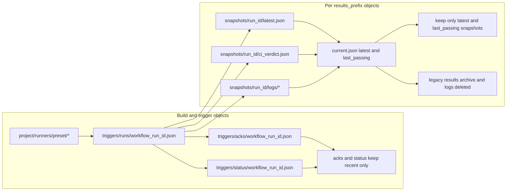

# BMT Diagrams

This file is the canonical location for Mermaid diagrams used by BMT docs.

## End-To-End Sequence

```mermaid
sequenceDiagram
    autonumber
    participant Dev as Developer
    participant CI as GitHub Actions ci.yml
    participant BMT as GitHub Actions bmt.yml
    participant GCS as GCS
    participant VM as VM vm_watcher.py
    participant GH as GitHub API

    Dev->>CI: push or pull_request on dev
    CI->>CI: build and upload runner artifacts
    CI->>BMT: workflow_dispatch with ci_run_id and head sha

    BMT->>GCS: upload runner bundle to project/runners/preset
    BMT->>GCS: write triggers/runs/workflow_run_id.json
    BMT->>VM: start VM instance
    BMT->>GCS: wait for triggers/acks/workflow_run_id.json
    BMT->>GH: post pending commit status
    BMT-->>Dev: workflow ends

    VM->>GCS: startup sweep trim triggers/acks and triggers/status
    VM->>VM: startup sweep prune local run dirs
    VM->>GCS: poll and read run trigger
    VM->>GCS: write triggers/acks/workflow_run_id.json
    VM->>GCS: write triggers/status/workflow_run_id.json
    VM->>GH: create check run and post pending

    loop one leg per project and bmt_id
        VM->>VM: run root_orchestrator.py
        VM->>VM: run project bmt_manager.py
        VM->>GCS: write snapshots/run_id/latest.json
        VM->>GCS: write snapshots/run_id/ci_verdict.json
        VM->>GH: update check run progress
    end

    VM->>GCS: update current.json latest and last_passing
    VM->>GCS: delete snapshots not in latest or last_passing
    VM->>GCS: delete legacy results archive and logs prefixes
    VM->>GH: complete check run and post final status
    VM->>GCS: delete triggers/runs/workflow_run_id.json
    VM->>GCS: trim triggers/acks and triggers/status to recent
    VM->>VM: prune local run dirs to current and previous
    VM->>VM: exit when exit_after_run is enabled
```

## VM Processing Flow

```mermaid
flowchart TD
    A[Watcher starts] --> B[Startup cleanup]
    B --> C[Trim triggers/acks and triggers/status]
    C --> D[Prune local run dirs]
    D --> E[Scan triggers/runs]
    E --> F{Trigger found}
    F -->|No| E
    F -->|Yes| G[Download run payload]
    G --> H{Payload valid and has legs}
    H -->|No| I[Delete trigger file]
    I --> E
    H -->|Yes| J[Write handshake ack and status]
    J --> K[Start heartbeat thread]
    K --> L[Download root_orchestrator.py]
    L --> M{Download ok}
    M -->|No| N[Post failure status]
    M -->|Yes| O[Run each leg via orchestrator]
    O --> P[Update progress and check run]
    P --> Q{More legs}
    Q -->|Yes| O
    Q -->|No| R[Aggregate outcome]
    R --> S[Finalize status and check run]
    S --> T[Update current.json latest and last_passing]
    T --> U[Delete stale snapshots]
    U --> V[Delete legacy results history prefixes]
    V --> W[Post final commit status]
    N --> X[Finally block cleanup]
    W --> X
    X --> Y[Stop heartbeat thread]
    Y --> Z[Delete trigger file]
    Z --> AA[Trim triggers/acks and triggers/status]
    AA --> AB[Prune local run dirs]
    AB --> AC{exit_after_run enabled}
    AC -->|Yes| AD[Exit watcher]
    AC -->|No| E
```

## GCS Object Lifecycle

```mermaid
flowchart LR
    subgraph BuildAndTrigger[Build and trigger objects]
      RUNNER["project/runners/preset/*"]
      TRIG["triggers/runs/workflow_run_id.json"]
      ACK["triggers/acks/workflow_run_id.json"]
      STAT["triggers/status/workflow_run_id.json"]
      META["acks and status keep recent only"]
    end

    subgraph PerBmtResults[Per results_prefix objects]
      SNAP["snapshots/run_id/latest.json"]
      VERDICT["snapshots/run_id/ci_verdict.json"]
      LOGS["snapshots/run_id/logs/*"]
      PTR["current.json latest and last_passing"]
      GC["keep only latest and last_passing snapshots"]
      LEGACY["legacy results archive and logs deleted"]
    end

    RUNNER --> TRIG
    TRIG --> ACK
    TRIG --> STAT
    ACK --> META
    STAT --> META
    TRIG --> SNAP
    TRIG --> VERDICT
    TRIG --> LOGS
    SNAP --> PTR
    VERDICT --> PTR
    LOGS --> PTR
    PTR --> GC
    PTR --> LEGACY
```
