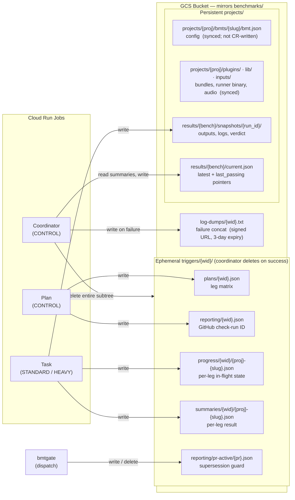

# GCS Storage & Coordination Model

Answers: *What is ephemeral vs durable, what keys matter, and who writes what?*

## Key facts

| Question | Answer |
| --- | --- |
| Where do I look for a live run? | `triggers/{wid}/` — plan, progress, summaries |
| Where do I look after a run? | `projects/.../results/` — snapshots + `current.json` |
| What does the coordinator read before writing `current.json`? | `triggers/summaries/{wid}/**` (all leg results) + existing `current.json` (`last_passing` pointer) |
| When are ephemeral keys deleted? | After coordinator calls `publish_final_results()` — successful **and** failed runs |
| Which keys survive across runs? | Everything under `projects/` (`snapshots/` pruned to latest + last_passing) |
| What is `last_passing`? | The `run_id` of the last run where all legs passed; used by tasks as the baseline snapshot |
| What can be partial / racy? | `triggers/summaries/` — a task crash leaves a leg absent; coordinator treats absent = failure |
