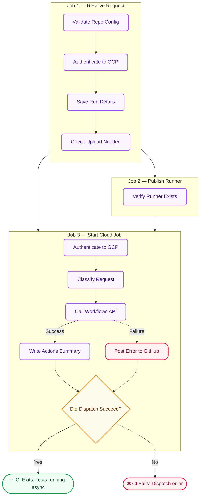

# BMT pipeline — diagrams

Visual companion to [architecture.md](architecture.md). **Canonical paths:** stage mirror = `benchmarks/`; container runtime = `backend/`.

---

## Background

**BMT (Batch Model Testing)** is an automated quality check for audio models. It runs whenever a developer pushes code or opens a Pull Request (PR):

1. GitHub CI builds the code and uploads the test program (**runner**) to Google Cloud Storage (GCS).
2. CI starts a test job in **Google Cloud Run** and finishes immediately. It doesn't wait for the tests to finish.
3. Cloud Run executes the runner against a fixed set of audio files and calculates **NAMUH scores** (an audio quality metric).
4. Cloud Run compares these new scores against the **baseline** (the scores from the last successful run).
5. Cloud Run posts a **pass/fail** result back to the GitHub PR. A PR cannot merge until BMT passes.

### Key terms

| Term | Meaning |
| --- | --- |
| **runner** | The compiled program that actually runs the audio tests. |
| **plugin** | A project-specific Python script that sets up and invokes the runner. |
| **leg** | A single test case (one project combined with one BMT configuration). |
| **Benchmark** (path) | Short URL-safe folder name (e.g., `false_rejects`). Docs use **`<benchmark>`** in paths so it is not confused with **`bmt.json`**. The manifest field **`bmt_slug`** holds the same string. |
| **snapshot** | All the outputs from a single test run (scores, pass/fail status, and logs). |
| **baseline** | The snapshot from the last successful test run. New scores are compared against this. |
| **GCS** | Google Cloud Storage. Used as a shared storage layer between GitHub CI and Cloud Run. |
| **run_id** | The unique ID of the GitHub Actions workflow. It groups all GCS files together for a single CI run. |

---

## Color key

🟦 **GitHub CI** · 🟩 **☁️ GCP / Cloud Run** · 🟨 **🪣 GCS Storage** · 🟥 **🐙 GitHub API**

---

## 1. End-to-end overview

CI starts the pipeline and stops. All testing and reporting back to GitHub happen asynchronously inside Cloud Run.

```mermaid
%%{init: {'flowchart': {'curve': 'basis'}}}%%
flowchart LR
    classDef ci fill:#eff6ff,stroke:#3b82f6,stroke-width:2px,color:#1e3a8a,rx:8px,ry:8px
    classDef gcp fill:#f0fdf4,stroke:#22c55e,stroke-width:2px,color:#14532d,rx:8px,ry:8px
    classDef gcs fill:#fefce8,stroke:#eab308,stroke-width:2px,color:#713f12,rx:8px,ry:8px
    classDef gh fill:#fff1f2,stroke:#f43f5e,stroke-width:2px,color:#881337,rx:8px,ry:8px
    classDef trigger fill:#f3f4f6,stroke:#6b7280,stroke-width:2px,stroke-dasharray: 5 5,rx:15px,ry:15px

    E([🚀 Push / PR / Manual]):::trigger

    subgraph CI_ENV[GitHub CI Environment]
        direction TB
        B[Compile + Unit Tests]:::ci
        H[Prepare BMT Request]:::ci
        R[Validate Prerequisites]:::ci
        P[Upload Runner to GCS]:::ci
        C[Dispatch to Cloud Run]:::ci

        B --> H --> R --> P --> C
    end

    GCP([☁️ Cloud Run: Run Tests]):::gcp
    GCS[(🪣 Google Cloud Storage)]:::gcs
    GH([🐙 GitHub: Commit / PR]):::gh

    E --> B
    C -->|Async Dispatch| GCP
    C -.->|Dispatch Failure| GH
    GCP <-->|Runner, Config, Results| GCS
    GCP -->|Post Results via App Token| GH
```



> **Security Note:** Cloud Run authenticates back to GitHub using a GitHub App token stored safely in GCP Secrets Manager. No long-lived GitHub secrets are passed to Cloud Run.

---

## 2. Handoff: GitHub CI → Cloud Run (`bmt-handoff.yml`)

This workflow runs after the code builds successfully. It checks requirements, uploads the runner if needed, and starts the Cloud Run job. **CI exits as soon as the Cloud Run job starts.**



| Step | What it does |
| --- | --- |
| **Validate repo config** | Checks that all required GitHub variables are set correctly (e.g., `GCS_BUCKET`, `GCP_PROJECT`). |
| **Authenticate to GCP** | Trades a GitHub OIDC token for a short-lived Google Cloud token. No persistent secrets are used. |
| **Save run details** | Saves information like the commit SHA, branch name, and PR number to a shared context file. |
| **Check upload needed** | Skips uploading the runner if the exact same content digest is already in GCS. |
| **Verify runner exists** | Confirms the compiled runner artifact is present before attempting to upload it. |
| **Classify request** | Determines which test legs need to run based on the project configuration. |
| **Call Workflows API** | Triggers the `bmt-workflow` in Cloud Run via REST API. CI's job terminates here. |
| **Post error status** | If Cloud Run dispatch fails, it immediately posts an error state to GitHub so the PR is not stuck pending forever. |

---

## 3. Cloud Run workflow: test execution + reporting (`bmt-workflow`)

Runs in GCP after CI exits. **Stages:** **Plan** → **task invocations** (one leg per job) → **Coordinator**. The Workflow schedules task jobs; **standard** and **heavy** profiles are **not** meant to run as one unstructured parallel blob—see [architecture.md](architecture.md) and [ROADMAP.md](../ROADMAP.md) for the ordered execution map.

```mermaid
%%{init: {'flowchart': {'curve': 'basis'}}}%%
flowchart TD
    classDef gcp fill:#f0fdf4,stroke:#22c55e,stroke-width:2px,color:#14532d,rx:6px,ry:6px
    classDef gcs fill:#fefce8,stroke:#eab308,stroke-width:2px,color:#713f12,rx:6px,ry:6px
    classDef gh fill:#fff1f2,stroke:#f43f5e,stroke-width:2px,color:#881337,rx:15px,ry:15px
    classDef entry fill:#f3f4f6,stroke:#6b7280,stroke-width:2px,rx:15px,ry:15px

    ENTRY([☁️ Cloud Run Execution Starts]):::entry

    subgraph PLAN[Stage 1 — Plan]
        direction TB
        P1[Load Config & Auth]:::gcp
        P2[Partition Standard & Heavy Legs]:::gcp
        P3[(Write Plan to GCS)]:::gcs
        P1 --> P2 --> P3
    end

    subgraph TASKS[Stage 2 — Task jobs (one leg each)]
        direction TB
        T1[(Read Plan)]:::gcs
        T2[Run Audio Tests]:::gcp
        T3[(Save Snapshot & Signal)]:::gcs
        T4[Notify GitHub: In Progress]:::gcp
        T1 --> T2 --> T3 --> T4
    end

    subgraph COORD[Stage 3 — Coordinator]
        direction TB
        C1[(Load leg summaries from GCS)]:::gcs
        C2[(Read last_passing from current.json)]:::gcs
        C3[Write current.json & prune snapshots]:::gcp
        C4[Finalize GitHub status Check PR]:::gcp
        C1 --> C2 --> C3 --> C4
    end

    CG([🐙 Post Status to Commit]):::gh
    CH([🐙 Update Check Run]):::gh
    CI([🐙 Post Score Summary to PR]):::gh

    ENTRY --> PLAN
    PLAN -->|Workflow runs N task executions| TASKS
    TASKS --> COORD
    C4 --> CG & CH & CI
```

| Stage | What it does |
| --- | --- |
| **Plan** | Reads project settings from GCS, partitions legs (e.g. standard vs heavy), writes the frozen plan. |
| **Task jobs** | Each invocation runs **one** leg: plugin + runner, **evaluate** vs baseline, snapshot + `triggers/summaries/`, `publish_progress` on the shared Check Run. |
| **Coordinator** | After all task work completes: load summaries, update `current.json`, prune snapshots, `publish_final_results`, `cleanup_ephemeral_triggers`. Does **not** re-score. |

> **Understanding `current.json`:** This file acts as a pointer. It stores the `run_id` of the `latest` run and the `last_passing` run. **Baseline comparison for gating** happens during each **task** (plugin `evaluate` using the prior `last_passing` snapshot). The **coordinator** only merges **leg outcomes** into new pointer values and prunes snapshots.
> **GitHub Check Runs:** After the plan is written to GCS, the **plan job** creates an in-progress Check Run (GitHub App) and writes `triggers/reporting/{run_id}.json` with `check_run_id`, `workflow_execution_url` (from `BMT_WORKFLOW_EXECUTION_URL`, set by the parent GCP Workflow from built-in env vars), and `started_at`. Task jobs call `publish_progress` to update that Check Run; the coordinator finalizes it. If GitHub is unavailable, the job logs a warning and BMT still runs; **commit status** and **PR comment** remain the primary pass/fail signals.

---

## 4. GCS bucket structure

```text
🪣 gs://bucket/
├── ⚡ triggers/                     # Ephemeral - deleted after coordinator succeeds
│   ├── plans/
│   │   └── run_id.json
│   ├── progress/
│   │   └── run_id/
│   │       └── project-bmt.json
│   ├── summaries/
│   │   └── run_id/
│   │       └── project-bmt.json
│   └── reporting/
│       └── run_id.json             # check_run_id + workflow console URL (plan job)
├── 📁 projects/                    # Persistent - seed data & results
│   └── project/
│       ├── project.json
│       ├── bmts/
│       │   └── benchmark/
│       │       └── bmt.json        # Test settings (thresholds, args)
│       ├── plugins/
│       │   └── name/
│       │       └── digest/
│       ├── plugin_workspaces/
│       │   └── name/
│       ├── inputs/
│       │   └── benchmark/
│       │       └── *.wav           # Input audio dataset
│       ├── mock_kardome_runner     # ⚙️ Compiled runner binary
│       └── results/
│           └── benchmark/
│               ├── current.json    # Run pointer (baseline)
│               └── snapshots/
│                   └── run_id/     # One snapshot per execution
│                       ├── latest.json       # Full score details
│                       ├── ci_verdict.json   # Pass/Fail boolean
│                       └── logs/             # Execution logs
└── 🗑️ log-dumps/                   # Temporary - 3-day TTL
    └── run_id.txt                  # Full error dump linked in PR comment
```

### Directory roles

| Directory | Contents | Lifetime |
| --- | --- | --- |
| `triggers/` | Coordination state files used by Cloud Run tasks (plans, progress, signals). | **Ephemeral:** Deleted by **`cleanup_ephemeral_triggers`** in the coordinator after **`publish_final_results`** succeeds (plan, progress, summaries, reporting JSON for that `run_id`). |
| `projects/` | Core configuration, plugins, input datasets, runner binaries, and all historical test snapshots. | **Persistent:** Written once, updated only upon deployment or a new run completion. |
| `log-dumps/` | Large execution logs for failed runs, viewable via a signed URL. | **Temporary:** Automatically deleted after 3 days. |

---

## Cross-diagram data flow

If you need to trace where a file is written and read across the architecture, use this reference:

| File / Artifact | Written by | Read by |
| --- | --- | --- |
| `triggers/plans/{run_id}.json` | Plan job | Task jobs (read plan), coordinator (read then delete) |
| `triggers/progress/{run_id}/…` | Task jobs (per leg) | Same task’s `publish_progress` (reads for Check Run body); not read by GitHub directly |
| `triggers/summaries/{run_id}/…` | Task jobs | Coordinator loads each leg summary |
| `results/{benchmark}/snapshots/{run_id}/` | Task Jobs | Coordinator, Local Dev Tools |
| `results/{benchmark}/current.json` | Coordinator | Next run (baseline), Local Dev Tools |
| `log-dumps/{run_id}.txt` | Coordinator (on failure) | Developers (via signed URL in PR comment) |
| `triggers/reporting/{run_id}.json` | Plan job (after `triggers/plans/…`) | Task jobs (`publish_progress`), coordinator (`finalize_check_run`); deleted after coordinator succeeds |
