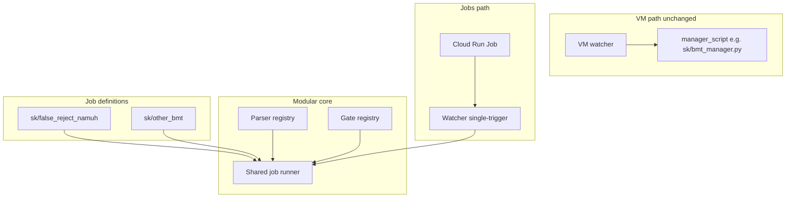

# Modular BMT Architecture and Cloud Run Jobs Plan

> **For Claude:** REQUIRED SUB-SKILL: Use superpowers:executing-plans to implement this plan task-by-task.

**Goal:** Redesign bmt-gcloud for cloud jobs first: a shared, reusable, modular architecture where adding a new BMT is declarative (job definition + parser/gate reference) with optional code adapters for custom parsing or score evaluation. Then implement the Cloud Run Jobs backend to execute that design. End state: full migration to Jobs, VM deprecation/removal, optional bucket redesign.

**Recommended job-definition style (hybrid):** Declarative job definitions (YAML/JSON) that reference **named parsers and gates** (e.g. `parser: namuh_counter`, `gate: baseline_gte`) plus job-specific params (runner URI, template, dataset, tolerance). When built-in parsers/gates are insufficient, a job can reference an **optional code adapter** (e.g. a Python callable or script). This keeps most new BMTs to "add one entry" while allowing custom logic without forking the orchestrator.

**Architecture (design-first):**

- **Single job definition schema** — One format for all BMTs: id, project, runner, template, dataset/results paths, `parser` (name + params), `gate` (name + params), runtime/cache/artifact options. Existing [gcp/code/sk/config/bmt_jobs.json](gcp/code/sk/config/bmt_jobs.json) and per-project manager logic are the reference; the new schema generalizes them so multiple projects/BMTs share the same structure.
- **Parser interface** — Inputs: runner stdout and/or per-file result paths. Output: aggregate score (float), optional raw score, optional per-file breakdown. **Built-in parsers:** e.g. `namuh_counter` (regex from config: keyword + counter_pattern). **Adapter:** optional `adapter: python:module.function` or path to script for custom extraction.
- **Gate interface** — Inputs: current score, baseline score (from pointer), run_context, params (e.g. tolerance_abs, comparison). Output: passed (bool), reason (str). **Built-in gates:** e.g. `baseline_gte`, `baseline_lte` (with tolerance). **Adapter:** optional custom gate for thresholds or multi-metric rules.
- **Shared job runner** — One orchestration flow: load job definition by (project, bmt_id) -> resolve runner/template/dataset from GCS -> run runner per WAV (thread pool) -> run parser on outputs -> resolve baseline from pointer -> run gate -> write snapshot/verdict/pointer. No per-project manager script; the runner is generic and driven by the job def + parser/gate registry.
- **Registry/discovery** — Parsers and gates are registered by name (e.g. in code or a small manifest). Job definitions reference them by name. Built-ins live in a core library (e.g. `gcp/code/parsers/`, `gcp/code/gates/`); adapters can be added per repo.

**Tech stack:** Python 3.12, same GCS/code+runtime layout during transition, Cloud Run Jobs, Secret Manager. **Infra:** Terraform only for GCP (Cloud Run Job, service account, Secret Manager bindings, IAM). Image build remains Cloud Build or GitHub Actions; Terraform references the image by tag. SLSA and Dagger are out of scope for this plan. New application code: job definition schema (YAML or JSON), parser/gate interfaces and built-in implementations, single shared job runner used by Jobs backend (VM keeps manager script).

**Worktree:** All work in a Worktrunk worktree (e.g. `wt switch --create feature/modular-bmt-cloud-run-jobs`). Main stays on current behavior; merge when ready. VM backend remains intact for rollback until full migration.

**VM behavior unchanged (hard guarantee):** During implementation and after merge, the VM execution path must remain identical to today. Concretely: (1) The VM never receives `--workflow-run-id` / `WORKFLOW_RUN_ID`; it keeps the existing poll loop and trigger discovery. (2) When processing a leg, the orchestrator/watcher invokes the **existing manager script** (e.g. `sk/bmt_manager.py`) for VM runs. It invokes the **modular job_runner** only when the execution context is Cloud Run Job (e.g. `WORKFLOW_RUN_ID` is set). So: VM path = manager script only; Jobs path = job_runner only. This allows full implementation and test of the new stack without affecting VM behavior. The only shared change is pointer CAS (read-modify-write with generation check), which is backward compatible for a single writer (VM).

**Migration readiness:** The design prepares for eventual full migration: one execution core (job_runner), backend-agnostic trigger/handshake, Terraform-managed Job infra, and config-driven cutover (repo vars). When migrating, turn on Jobs and remove the VM path; no second system to build.

---

## Phase 0: Architecture design document (no code)

**Deliverable:** A short design doc (e.g. in [docs/plans/](.) or [docs/architecture.md](../architecture.md)) that defines:

1. **Job definition schema** — Fields: id, project, bmt_id, runner (uri, deps_prefix), template_uri, paths (dataset_prefix, results_prefix, outputs_prefix, logs_prefix), parser (name + params), gate (name + params), runtime (cache, overrides), warning_policy, artifacts. Example mapping from current [bmt_jobs.json](../../gcp/code/sk/config/bmt_jobs.json) and [bmt_manager.py](../../gcp/code/sk/bmt_manager.py) (parsing.keyword/counter_pattern -> parser params; gate.comparison/tolerance_abs -> gate params). **Acceptance:** Schema must represent at least SK false_reject_namuh without extension.
2. **Parser contract** — Input: (runner_stdout_path or list of per-file result dicts, job_parser_params). Output: dict with aggregate_score, optional raw_aggregate_score, optional per_file. Built-in: `namuh_counter` with params `keyword`, `counter_pattern`. Adapter: reference to Python callable or script. **Acceptance:** namuh_counter behavior matches current bmt_manager extraction.
3. **Gate contract** — Input: (current_score, baseline_score, run_context, job_gate_params, failed_count). Output: dict with passed, reason, last_score. Built-in: `baseline_gte` / `baseline_lte` with params `tolerance_abs`, optional `baseline_zero_is_missing`. **Acceptance:** baseline_gte/lte match current _gate_result and _effective_gate_comparison semantics.
4. **Shared runner flow** — Diagram or numbered steps: load job def -> fetch runner/template/dataset from GCS -> run runner per WAV -> collect results -> parse -> resolve baseline from current.json -> gate -> write snapshot (latest.json, ci_verdict.json) and update pointer (CAS). Clarify compatibility with existing watcher/CI (same summary shape and snapshot layout).
5. **Backend split** — VM path: orchestrator invokes manager_script (existing), no job_runner. Jobs path: watcher runs with WORKFLOW_RUN_ID set, orchestrator/watcher invokes job_runner per leg. Single-trigger mode only when WORKFLOW_RUN_ID is set.

No code changes in Phase 0; the doc is the contract for Phases 1–2. **Definition of done:** Design doc reviewed and schema/contracts accepted before starting Phase 1.

---

## Phase 1: Modular core (schema + parsers + gates + shared runner)

**Scope:** Implement the design in [gcp/code/](../../gcp/code/) so that a single "job runner" can execute any BMT described by the new job definition format. Prefer keeping existing GCS layout (code/, runtime/, triggers, pointer, snapshots) so the current watcher and CI keep working; the runner is the only new execution path invoked when WORKFLOW_RUN_ID is set.

### Task 1.1: Job definition schema and loader

**Files:** New schema module (e.g. [gcp/code/job_schema.py](../../gcp/code/job_schema.py) or under [gcp/code/core/](../../gcp/code/core/)), and a loader that reads from GCS or local path.

- Define the job definition structure (dataclasses or a single dict spec): id, project, bmt_id, runner, template_uri, paths, parser (name + params), gate (name + params), runtime, warning_policy, artifacts.
- Loader: given (bucket, project, bmt_id) or (path to jobs manifest), return one job definition. Support current per-project JSON (e.g. sk/config/bmt_jobs.json) by mapping existing fields into the new schema so existing SK BMT works without changing config yet, or introduce a single merged manifest (e.g. jobs/bmt_jobs.yaml) that lists all jobs and migrate SK into it.
- Validate required fields and parser/gate names.

### Task 1.2: Parser interface and built-in implementations

**Files:** [gcp/code/parsers/](../../gcp/code/parsers/) (or [gcp/code/core/parsers/](../../gcp/code/core/parsers/)).

- **Interface:** e.g. `def parse(artifact_paths_or_stdout: ..., params: dict) -> dict` with keys aggregate_score, optional raw_aggregate_score, optional per_file.
- **Built-in `namuh_counter`:** Take params `keyword`, `counter_pattern` (regex); scan runner stdout or result file(s) and extract aggregate (e.g. sum or last NAMUH counter). Match current behavior in [bmt_manager.py](../../gcp/code/sk/bmt_manager.py) (counter_pattern, aggregation).
- **Registry:** Map parser name -> callable (e.g. `REGISTRY = {"namuh_counter": namuh_counter_impl}`). Optional: adapter loader for `adapter: python:path.to.function`.

### Task 1.3: Gate interface and built-in implementations

**Files:** [gcp/code/gates/](../../gcp/code/gates/) (or [gcp/code/core/gates/](../../gcp/code/core/gates/)).

- **Interface:** e.g. `def evaluate(current_score: float, baseline_score: float | None, run_context: str, params: dict, failed_count: int) -> dict` with keys passed, reason, last_score.
- **Built-in `baseline_gte` / `baseline_lte`:** Tolerance from params (`tolerance_abs`), bootstrap when baseline is None or (optional) zero. Match [bmt_manager.py](../../gcp/code/sk/bmt_manager.py) `_gate_result` and `_effective_gate_comparison` (e.g. false_reject -> gte).
- **Registry:** Map gate name -> callable. Optional adapter for custom gates.

### Task 1.4: Shared job runner

**Files:** New [gcp/code/job_runner.py](../../gcp/code/job_runner.py) (or [gcp/code/core/runner.py](../../gcp/code/core/runner.py)).

- **Flow:** Load job def (Task 1.1) -> resolve runner binary and template from GCS -> resolve dataset list -> run runner per WAV (reuse or factor current run-one loop from bmt_manager) -> collect per-file results -> call parser from registry -> resolve baseline from current.json (reuse pointer read) -> call gate from registry -> build verdict dict -> write snapshot (latest.json, ci_verdict.json) and optionally update pointer (CAS, see below). Same I/O contract as current manager summary so watcher can consume it.
- **Inputs:** bucket, project_id, bmt_id, run_id, run_context, workspace_root, jobs_config path or job def. **Outputs:** manager summary (dict) and written snapshot/verdict paths.
- **Pointer update:** Use generation-based CAS for current.json when writing (required for concurrent Jobs); factor or reuse from existing plan so one implementation serves both legacy and new runner.

### Task 1.5: Wire Jobs path to modular runner; keep VM on manager script

**Files:** [gcp/code/root_orchestrator.py](../../gcp/code/root_orchestrator.py), [gcp/code/vm_watcher.py](../../gcp/code/vm_watcher.py) (or wherever per-leg execution is decided), [gcp/code/sk/config/bmt_jobs.json](../../gcp/code/sk/config/bmt_jobs.json) (or new jobs manifest).

- **VM path (unchanged):** When the run is **not** in Cloud Run Job context (i.e. `WORKFLOW_RUN_ID` is not set), the orchestrator continues to download and invoke the project's **manager_script** (e.g. `sk/bmt_manager.py`) as today. No call to job_runner. This preserves VM behavior exactly.
- **Jobs path:** When the run **is** in Cloud Run Job context (e.g. `WORKFLOW_RUN_ID` is set in the environment), the orchestrator/watcher invokes the **modular job_runner** with (bucket, project_id, bmt_id, run_id, run_context, ...). Job runner loads the job definition via the schema loader (Task 1.1) and runs the shared flow. Do not invoke the manager script in this context.
- **Detection:** Use a single condition: e.g. `if os.environ.get("WORKFLOW_RUN_ID"): use job_runner else: use manager_script`. Document this in the design doc and in code comments.
- **SK job def:** Ensure SK (e.g. false_reject_namuh) is loadable by the schema (map existing bmt_jobs.json into the schema or add a unified manifest). At least one BMT must run end-to-end via job_runner in tests and in a real Job run; VM continues to run the same BMT via sk/bmt_manager.py.
- **No VM cutover in this task:** Do not switch the VM to use job_runner. That is reserved for a future "full migration" step after Jobs are proven in production.

---

## Phase 2: Cloud Run Jobs backend (single-trigger, execute job, handshake)

**Scope:** Add Cloud Run Jobs as the execution backend: workflow writes trigger, executes job, waits for handshake; job runs watcher in single-trigger mode; watcher runs the shared job runner per leg. VM path unchanged (same repo, same handoff steps gated by BMT_RUNTIME_BACKEND=vm) for rollback.

### Task 2.1: Single-trigger watcher and idempotency

**Files:** [gcp/code/vm_watcher.py](../../gcp/code/vm_watcher.py).

- Add CLI arg `--workflow-run-id` and/or read env `WORKFLOW_RUN_ID`. **When set (Jobs context):** Do not call `_discover_run_triggers`. Build single trigger URI `{runtime_root}/triggers/runs/{workflow_run_id}.json`. If object does not exist, exit with clear error. **Idempotency:** If `triggers/acks/<workflow_run_id>.json` already exists, exit 0 without running legs. Otherwise call `_process_run_trigger` once for that URI, then exit (no poll loop).
- **When not set (VM context):** Behavior unchanged. Continue to use `_discover_run_triggers` and the existing poll loop; no single-trigger path.
- **Per-leg execution inside _process_run_trigger:** When `WORKFLOW_RUN_ID` is set, invoke the modular job_runner for each (project, bmt_id) leg (and ensure job def is loadable). When `WORKFLOW_RUN_ID` is not set, invoke the existing manager_script per project as today. Do not change the VM code path.

### Task 2.2: current.json CAS and per-run root summary

**Files:** [gcp/code/vm_watcher.py](../../gcp/code/vm_watcher.py), [gcp/code/root_orchestrator.py](../../gcp/code/root_orchestrator.py).

- **Pointer update:** In `_update_pointer_and_cleanup`, replace plain read-then-write of `current.json` with generation-based CAS using `google-cloud-storage`: read blob and generation, update in memory, write with `if_generation_match=<generation>`. On 412, retry read-modify-write up to 3 times with short backoff. This is backward compatible for the VM (single writer; generation always matches). Required for concurrent Jobs.
- **Per-run root summary:** When writing root summary from the orchestrator, use path `runtime/root_summaries/<workflow_run_id>/<project>_<bmt_id>.json` so concurrent jobs do not overwrite. Ensure watcher does not depend on reading this path from GCS (it uses local run_root for manager summaries). If the VM path currently writes to a single shared file, keep that for VM-only or migrate both paths to the per-run path; document the choice in the design doc.

### Task 2.3: CLI and workflow (execute job, trigger, handoff branch)

**Files:** [.github/bmt/cli/commands/](../../.github/bmt/cli/commands/) (job.py, trigger.py, vm.py), [.github/actions/bmt-handoff-run/action.yml](../../.github/actions/bmt-handoff-run/action.yml), [.github/workflows/bmt.yml](../../.github/workflows/bmt.yml).

- Add `execute-cloud-run-job` command; allow multiple triggers when BMT_RUNTIME_BACKEND=cloud_run_job; select-available-vm no-op for cloud_run_job; handoff action branches on backend (skip VM steps, add execute step); handshake diagnostics backend-aware.
- **Terraform:** New directory [terraform/](../../terraform/) (or [infra/terraform/](../../infra/terraform/)). Required variables: `project`, `region`, `gcs_bucket_name`, `job_image` or `job_image_tag`. GCS backend for state. Resources: Cloud Run Job (`google_cloud_run_v2_job`), Job service account, IAM (Job SA -> GCS + Secret Manager; workflow identity -> run.invoker), Secret Manager references. Docs in [docs/configuration.md](../configuration.md).

### Task 2.4: Terraform for Cloud Run Job and IAM

**Files:** New directory [terraform/](../../terraform/) (or [infra/terraform/](../../infra/terraform/)) in the repo.

- **Scope:** Terraform is the single way to create and update the Cloud Run Job and its dependencies. No manual `gcloud` or console for these resources.
- **Required variables:** Document and implement: `project`, `region`, `gcs_bucket_name`, `job_image` (full URI) or `job_image_tag` (tag only; resolve URI in Terraform using `region-docker.pkg.dev/project/repo/name:tag`). Optional: `job_name`, `job_task_timeout_sec`, `job_max_retries`.
- **Backend:** Use GCS backend for state (e.g. `backend "gcs" { bucket = "..." prefix = "terraform/bmt-job" }`). Document in README or [docs/configuration.md](../configuration.md). Optionally use workspaces (e.g. default, dev, prod) if multiple envs are needed.
- **Resources:** Cloud Run Job (`google_cloud_run_v2_job`), Job service account, IAM (Job SA: storage + secretmanager; workflow: run.invoker), Secret Manager references. Do not create secret payloads in Terraform.
- **Docs:** "Cloud Run Jobs setup (Terraform)" in [docs/configuration.md](../configuration.md): `terraform init`, `terraform plan/apply`, required variables, backend config, prerequisite that secret values exist in Secret Manager.

### Task 2.5: Image build and runtime docs

**Files:** Dockerfile (e.g. [gcp/Dockerfile.bmt-job](../../gcp/Dockerfile.bmt-job)), [docs/configuration.md](../configuration.md).

- Image: Dockerfile that pulls code from GCS at startup and runs watcher with WORKFLOW_RUN_ID. Build and push via Cloud Build or Actions; Terraform (Task 2.4) references the resulting image.
- Document the full flow: build image -> push to Artifact Registry -> Terraform apply (or variable update) -> workflow sets BMT_RUNTIME_BACKEND=cloud_run_job and repo vars.

---

## Phase 3: Tests and docs

**Testing strategy (VM untouched):**

- **Unit:** Schema loader (valid/invalid job defs); parser `namuh_counter` on fixture stdout/files; gate `baseline_gte`/`baseline_lte` with tolerance and bootstrap; adapter resolution if implemented. No VM or GCS required.
- **Integration:** Run `job_runner` directly with a test job definition and mock or local GCS paths (or fixture bucket). Verify summary and verdict shape match what the watcher expects. Do not run the VM or the full watcher for this path.
- **Watcher single-trigger:** Test that with `WORKFLOW_RUN_ID` set and a trigger present, the watcher processes that trigger once and exits; test ack-exists idempotency (exit 0 without running legs). Mock GCS and orchestrator as in existing vm_watcher tests.
- **CLI/workflow:** Trigger allow-multiple when `BMT_RUNTIME_BACKEND=cloud_run_job`; `execute-cloud-run-job` with expected env and gcloud args (mock subprocess). Handoff action conditionals (backend-aware steps).
- **E2E (optional):** Run a real Cloud Run Job with a test trigger and bucket; verify handshake and one leg. VM is not used.
- **VM regression:** Existing tests that exercise the VM path (manager script, orchestrator with manager_script) must still pass. No tests should require the VM to run job_runner.

**Docs:** Update architecture doc with modular design; add "Adding a new BMT" (job def entry + parser/gate or adapter); document hybrid approach; document VM vs Jobs invocation rule (WORKFLOW_RUN_ID).

---

## Rollback and migration

- **During development:** All work in worktree; main unchanged. VM path never invokes job_runner; VM tests and behavior unchanged.
- **After merge:** Default remains `BMT_RUNTIME_BACKEND=vm`. To use Jobs: set repo vars (`BMT_RUNTIME_BACKEND=cloud_run_job`, `BMT_CLOUD_RUN_JOB`, `BMT_CLOUD_RUN_REGION`) and ensure Terraform-applied Job and image exist. To roll back: set `BMT_RUNTIME_BACKEND=vm`; no code revert.
- **Full migration (later):** Remove VM-only steps from the handoff action; remove or deprecate manager script invocation; decommission VM instances. Cutover is config plus code removal; job_runner becomes the only execution path.
- **End state:** Jobs-only; new BMTs via job definitions and optional parser/gate adapters; bucket redesign optional.

**Pre-merge checklist (worktree):** Design doc accepted; all Phase 3 tests pass; VM path still uses manager_script only; pointer CAS and per-run summary paths implemented; Terraform and image build documented.

---

## Summary diagram

