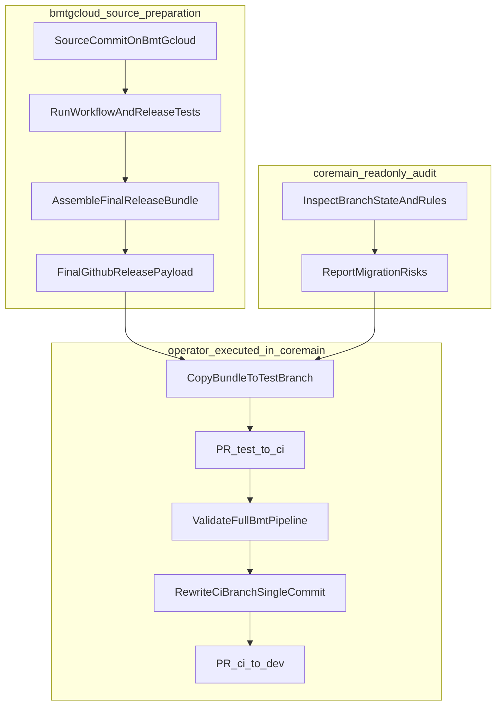

# bmt-gcloud Finalization + core-main No-Touch Migration Plan

## Scope and Constraint

- All direct edits/build/test/package work happens in `/home/yanai/sandbox/bmt-gcloud`.
- For `/home/yanai/kardome/core-main`, this plan is strictly read-only from the agent side: inspect, report, and hand off commands/checklist for a human operator.
- Outcome target: a finalized, verified `.github-release` payload and an execution-ready migration runbook for core-main.

## Current State Snapshot (Read-only findings)

- Local repo is at `/home/yanai/kardome/core-main` with `origin` at `Kardome-org/core-main`; default branch is `dev`; your access is `WRITE`.
- Remote branch divergence is large: `origin/dev...origin/ci/check-bmt-gate` = `58` / `98` commits (left/right), so a naive merge will produce noisy history/conflicts.
- `test/check-bmt-gate*` branches exist remotely and are marked protected.
- In `bmt-gcloud`, workflow/template changes are currently uncommitted and include trigger and handoff semantics changes; release bundle may be stale unless rebuilt from the exact final source commit.

## Likely Migration Issues

- **Stale release payload risk:** copying an older `.github-release` can silently omit recent trigger/handoff fixes.
- **Trigger behavior mismatch risk:** core-main template trigger and bmt-gcloud root trigger can diverge if package generation source is not aligned.
- **History rewrite risk on protected branches:** your target “single clean commit” on `ci/check-bmt-gate` may require force-push workflow/approval if branch update strategy is constrained.
- **Large divergence conflict risk:** rebasing test branch onto `ci/check-bmt-gate` (or vice versa) can cause workflow/template conflict churn.
- **Protection/ruleset opacity risk:** branch rules are protected, but direct status-context introspection via standard branch-protection API returned 404 (likely rulesets path/permission model); verification must be done by effective run outcomes and branch policy checks in UI/`gh` rules endpoint.
- **PR-only Cloud BMT constraint:** any push-triggered CI can still run build jobs; ensure `bmt_handoff` stays PR-only in both prod workflow and dev workflow variants.
- **Package/source drift risk:** `.github-release` contents can lag if package is generated before the final source commit lands.

## Execution Strategy (No core-main modifications by agent)

### Phase 0 — Freeze policy in bmt-gcloud source

- [ ] Ensure workflow policy is finalized in source:
  - full BMT only on PRs with base `dev` or `ci/check-bmt-gate`
  - push to `ci/check-bmt-gate` triggers build CI only
  - no direct-push BMT path
- [ ] Confirm affected source files:
  - `[/home/yanai/sandbox/bmt-gcloud/.github/workflows/build-and-test-dev.yml](/home/yanai/sandbox/bmt-gcloud/.github/workflows/build-and-test-dev.yml)`
  - `[/home/yanai/sandbox/bmt-gcloud/.github/workflows/build-and-test.yml](/home/yanai/sandbox/bmt-gcloud/.github/workflows/build-and-test.yml)`
  - `[/home/yanai/sandbox/bmt-gcloud/.github/workflows/trigger-ci.yml](/home/yanai/sandbox/bmt-gcloud/.github/workflows/trigger-ci.yml)`
  - `[/home/yanai/sandbox/bmt-gcloud/scripts/release_templates/workflows/trigger-ci.yml](/home/yanai/sandbox/bmt-gcloud/scripts/release_templates/workflows/trigger-ci.yml)`

### Phase 1 — Validate bmt-gcloud locally (authoritative tests)

- [ ] Run and record:
  - `uv run python -m pytest tests/ci/test_workflow_hardening.py -q`
  - `uv run python -m pytest tests/test_assemble_release.py -q`
- [ ] Verify test assertions still match intended trigger location and permissions model.

### Phase 2 — Build finalized release package

- [ ] Commit finalized source changes in bmt-gcloud.
- [ ] Regenerate `.github-release` from that exact commit SHA.
- [ ] Validate bundle contents include expected files and trigger semantics:
  - `[/home/yanai/sandbox/bmt-gcloud/.github-release/workflows/build-and-test.yml](/home/yanai/sandbox/bmt-gcloud/.github-release/workflows/build-and-test.yml)`
  - `[/home/yanai/sandbox/bmt-gcloud/.github-release/workflows/bmt-handoff.yml](/home/yanai/sandbox/bmt-gcloud/.github-release/workflows/bmt-handoff.yml)`
  - `[/home/yanai/sandbox/bmt-gcloud/.github-release/workflows/internal/trigger-ci.yml](/home/yanai/sandbox/bmt-gcloud/.github-release/workflows/internal/trigger-ci.yml)`
- [ ] Confirm manifest/provenance points to final source SHA.

### Phase 3 — core-main read-only pre-migration audit

- [ ] Re-check branch topology and divergence in core-main.
- [ ] Re-check existence/protection of:
  - `ci/check-bmt-gate`
  - `test/check-bmt-gate`*
- [ ] Collect effective ruleset snapshots for operator handoff.

### Phase 4 — Operator runbook (no-touch by agent)

- [ ] Provide exact operator steps to execute in core-main:
  1. Create/update `test/check-bmt-gate-release` from `origin/ci/check-bmt-gate`.
  2. Copy finalized `.github-release` payload into core-main.
  3. Open PR `test/check-bmt-gate-release -> ci/check-bmt-gate` and validate full pipeline.
  4. Rewrite `ci/check-bmt-gate` to a single clean commit over `origin/dev` with backup refs + dry-run push preview.
  5. Open final PR `ci/check-bmt-gate -> dev`.
- [ ] Include explicit dry-run commands for history rewrite and force-with-lease push preview before any real remote update.

### Phase 5 — Post-apply verification gates

- [ ] On staging PR (`test/check-bmt-gate-release -> ci/check-bmt-gate`), verify:
  - CI starts on PR event.
  - `bmt_handoff` runs only in PR context.
  - Cloud workflow/Cloud Run starts and completes; BMT check/status/comment update as expected.
- [ ] On final PR (`ci/check-bmt-gate -> dev`), verify:
  - Same behavior and stable repeated runs.
  - Required branch protections/status checks continue to gate merge correctly.

## file-todos Tracking

- If long-lived follow-ups appear, create/update `todos/` files with this naming:
  - `{issue_id}-{status}-{priority}-{description}.md`
- Candidate todo topics:
  - ruleset/protection visibility gaps on core-main
  - pipeline flakes during staging PR validation
  - release-package drift guardrails
- Keep this plan as the execution contract; use file-todos only for spillover work that should outlive this migration.

## Verification Checklist

- Workflow trigger matrix behavior matches policy:
  - PR to `dev` or `ci/check-bmt-gate` => full BMT path.
  - Push to `ci/check-bmt-gate` => build CI only, no cloud BMT handoff.
- Finalized release bundle references the intended source SHA and includes expected workflow/template files.
- Required branch protections on `ci/check-bmt-gate` and `test/check-bmt-gate`* remain intact after operator-applied branch updates.
- Final `ci/check-bmt-gate` history is one clean commit relative to `origin/dev` before opening PR to `dev` (operator-executed).

## Flow Diagram

