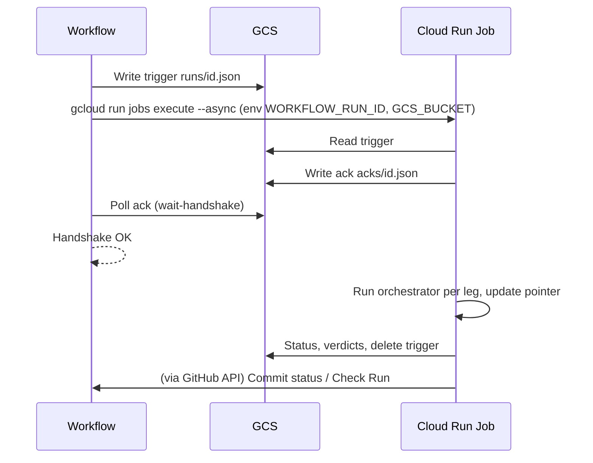

# Cloud Run Jobs backend implementation

## Is this an improvement over the current VM model?

**Yes — it eliminates the most complex and fragile parts of the current design.**

### What the VM model requires today

The current handoff action does the following for every run:

1. **Preflight trigger queue** (`bmt_cmd_preflight_trigger_queue`): Lists existing trigger files under `runtime/triggers/runs/`, validates each, deletes invalid ones, and deletes stale/blocking ones. If any stale triggers were removed, sets `restart_vm=true`.
2. **Write trigger**: Raises `RuntimeError` in `trigger.py` if any other pending trigger exists (VM can only process one at a time).
3. **Sync VM metadata**: Writes `GCS_BUCKET`, `BMT_REPO_ROOT`, and the inline startup script to VM instance metadata before start. Verifies the write succeeded.
4. **Force clean VM restart** (conditional): If `restart_vm=true`, stops the VM, polls until TERMINATED (up to 120s), then proceeds to start.
5. **Start VM** (complex): Issues `gcloud compute instances start`; handles idempotent errors (already running, fingerprint race, resource not ready); detects STOPPING state and waits for TERMINATED before retrying; waits for RUNNING; runs a 45-second stabilization window polling RUNNING to confirm the VM didn't crash; retries up to 2 recovery attempts if the VM becomes unstable during stabilization.
6. **Handshake wait**: Polls GCS every 5s for `triggers/acks/<run_id>.json` (written by the VM's watcher). Logs VM status every 15s. On timeout, reads VM serial output and raises a diagnostic error.
7. **VM asynchronously posts results** via GitHub API after BMT completes, then stops itself.

### Why Cloud Run Jobs removes this complexity

| VM complexity                                                              | Cloud Run Jobs equivalent                                                       |
| -------------------------------------------------------------------------- | ------------------------------------------------------------------------------- |
| Preflight stale-trigger cleanup (entire `preflight-trigger-queue` step)    | Not needed — each job handles exactly one trigger; no singleton to compete with |
| Serial execution constraint (blocking check in `trigger.py`)               | Not needed — concurrent jobs are fine; one container per `workflow_run_id`      |
| Metadata sync step (startup script, GCS_BUCKET written to VM before start) | Not needed — env vars passed at execute time via `--set-env-vars`               |
| Force clean VM restart (stop VM, wait TERMINATED, then start)              | Not needed — container is stateless and ephemeral                               |
| VM stabilization window (45s poll loop, recovery retries)                  | Not needed — container either starts or fails cleanly                           |
| Handshake timeout diagnostics including VM serial output                   | Simpler — check Cloud Run logs instead; no serial port to query                 |
| VM stops itself after each run (`--exit-after-run`)                        | Not needed — container exits naturally when watcher returns                     |

### Trade-offs

- **Image management**: VM pulls latest code from GCS on startup (startup wrapper syncs `code/`). Cloud Run Jobs need either (a) a pre-built image with code baked in (requires rebuild on code changes) or (b) an entrypoint that pulls from GCS at startup (similar to VM model, no rebuild required). Option (b) is recommended to match current behavior and avoid image churn.
- **Cold start**: VM is also always cold-starting (it stops itself after each run), so Cloud Run Jobs cold start is not a regression.
- **Secrets**: VM reads GitHub App keys from instance metadata (env vars set on the VM). Cloud Run Jobs should use Secret Manager secret bindings (projected as env vars to the task) — more secure than passing raw PEM as a `--set-env-vars` value.
- **Cost**: Persistent VM accrues cost when idle (if not stopped). Cloud Run Jobs are billed only for task execution time. For the VM backend, the VM is stopped after each run, so idle cost is minimal but non-zero (disk, static IP if any).

**Net assessment**: Cloud Run Jobs is a meaningful improvement. The VM model's complexity exists entirely to manage a stateful singleton that must be serialized, started reliably, and stabilized. Cloud Run Jobs eliminates all of that. The handshake and GCS trigger/ack protocol are already backend-agnostic and require no changes.

---

## What already exists

- **Config:** [docs/configuration.md](docs/configuration.md), [tools/repo_vars_contract.py](tools/repo_vars_contract.py), [.github/bmt/config/.env.example](.github/bmt/config/.env.example) define `BMT_RUNTIME_BACKEND` (`vm` | `cloud_run_job`), `BMT_CLOUD_RUN_JOB`, `BMT_CLOUD_RUN_REGION`. Workflow [.github/workflows/bmt.yml](.github/workflows/bmt.yml) passes these into the handoff job.
- **Trigger and handshake:** Trigger is written to `runtime/triggers/runs/<workflow_run_id>.json`; ack is at `runtime/triggers/acks/<workflow_run_id>.json`. [.github/bmt/cli/commands/vm.py](.github/bmt/cli/commands/vm.py) `run_wait_handshake()` polls GCS for the ack using `GITHUB_RUN_ID` and `GCS_BUCKET` — no VM-specific path. Handshake is backend-agnostic.
- **Tests:** [tests/test_wait_handshake.py](tests/test_wait_handshake.py) (handshake success/timeout/v2 fields), [tests/test_start_vm.py](tests/test_start_vm.py) (start-vm only), [tests/test_ci_commands.py](tests/test_ci_commands.py) (CLI command names). No Cloud Run or backend branch is tested yet.

## What is not implemented

- No code path reads `BMT_RUNTIME_BACKEND` or runs a Cloud Run Job.
- Handoff action always: sync VM metadata, start VM, wait handshake. No branch for `cloud_run_job`.
- Watcher has no single-trigger mode (process only one `workflow_run_id`); it always discovers all triggers and, with `--exit-after-run`, processes one then exits.
- No CLI command to execute the Cloud Run Job.
- Trigger write in [.github/bmt/cli/commands/trigger.py](.github/bmt/cli/commands/trigger.py) raises if other pending triggers exist ("VM runtime is busy"). For Cloud Run Jobs, multiple triggers are fine (one job per run).

---

## Implementation plan

### 1. Single-trigger mode in vm_watcher (remote/code)

**Goal:** When running as a Cloud Run Job, the worker must process only the trigger for this run, then exit.

- In [remote/code/vm_watcher.py](remote/code/vm_watcher.py):
  - Add optional `--workflow-run-id` argument (or read `WORKFLOW_RUN_ID` from env when running in job).
  - In `main()`: if `workflow_run_id` is set, do **not** call `_discover_run_triggers`. Instead build the single trigger URI from `runtime_bucket_root` and `workflow_run_id` (same convention as [.github/bmt/cli/shared/**init**.py](.github/bmt/cli/shared/__init__.py) `run_trigger_uri`: `{runtime_root}/triggers/runs/{sanitized_id}.json`). If that object does not exist, exit with a clear error. Otherwise call `_process_run_trigger` for that URI once, then exit (no poll loop, no `--exit-after-run` branch).
  - **Idempotency (required):** At the start of single-trigger processing, check if `triggers/acks/<workflow_run_id>.json` already exists in GCS. If so, exit 0 without re-running legs. This makes the task safe to retry (Cloud Run retries failed tasks up to 3 times by default).
  - Ensure the rest of `_process_run_trigger` (ack, status, orchestrator, pointer update, cleanup) is unchanged.

**Files:** [remote/code/vm_watcher.py](remote/code/vm_watcher.py), new test in `tests/test_vm_watcher_single_trigger.py` or extend existing vm_watcher tests.

---

### 2. Root orchestrator: per-run GCS path for bmt_root_results (remote/code)

**Goal:** Avoid parallel runs overwriting the same `runtime/bmt_root_results.json`.

- In [remote/code/root_orchestrator.py](remote/code/root_orchestrator.py): change the summary upload path from `runtime/bmt_root_results.json` to `runtime/root_summaries/<workflow_run_id>/<project>_<bmt_id>.json`. The orchestrator already receives `--workflow-run-id`; use it to build the per-run path. The watcher reads manager summaries from the local `run_root` (not from this GCS path), so the change is audit/debug only and has no functional impact on watcher logic.
- **Verify** that no watcher code path reads `bmt_root_results.json` from GCS before making this change.

**Files:** [remote/code/root_orchestrator.py](remote/code/root_orchestrator.py).

---

### 3. current.json pointer update: generation-based CAS (required for Cloud Run Jobs)

**Goal:** When multiple jobs for different (project, bmt_id) legs complete concurrently, pointer writes to `current.json` must not corrupt each other.

**This is required, not optional.** The current `_update_pointer_and_cleanup` in [remote/code/vm_watcher.py](remote/code/vm_watcher.py) does a read then write with no precondition. With Cloud Run Jobs running concurrent tasks, two tasks updating `current.json` for different bmt_ids in the same project can interleave their reads and writes, leaving the pointer with only one leg's data.

- Use `google-cloud-storage` Python client for `current.json` only: read the blob and its generation, update in memory, write with `if_generation_match=<generation>`. On 412 (precondition failed), retry the read-modify-write loop (up to 3 attempts with short backoff). This is a scoped addition of one dependency for one file operation.
- Alternative if the repo must stay gcloud-only: document that concurrent tasks for the same project are unsupported and enforce single-project-per-job-at-a-time. Strongly prefer the generation-based approach.

**Files:** [remote/code/vm_watcher.py](remote/code/vm_watcher.py), `remote/requirements.txt` or equivalent (add `google-cloud-storage`).

---

### 4. CLI: execute Cloud Run Job (.github/bmt)

**Goal:** Workflow can run `bmt execute-cloud-run-job` which calls `gcloud run jobs execute` with the right job name, region, and env vars.

- Add a new command in [.github/bmt/cli/commands/](../../../.github/bmt/cli/commands/), e.g. `job.py`, that:
  - Reads `GCP_PROJECT`, `BMT_CLOUD_RUN_JOB`, `BMT_CLOUD_RUN_REGION`, `GCS_BUCKET`, `GITHUB_RUN_ID` from env.
  - Runs `gcloud run jobs execute <job> --region <region> --project <project> --async --set-env-vars WORKFLOW_RUN_ID=<id>,GCS_BUCKET=<bucket>`. The `--async` flag is required so the command returns immediately; the workflow waits for the ack via the existing handshake step.
  - **Retry**: On `gcloud` failure, retry up to 2 times with exponential backoff (reuse `run_capture_retry` from [.github/bmt/cli/gcloud.py](.github/bmt/cli/gcloud.py) or equivalent).
- Register the command in [.github/bmt/cli/driver.py](.github/bmt/cli/driver.py).

**Files:** New [.github/bmt/cli/commands/job.py](.github/bmt/cli/commands/job.py), [.github/bmt/cli/driver.py](.github/bmt/cli/driver.py).

---

### 5. Trigger write: allow multiple triggers when backend is cloud_run_job

**Goal:** With Cloud Run Jobs, each handoff runs its own job, so multiple triggers can coexist; do not fail with "VM runtime is busy".

- In [.github/bmt/cli/commands/trigger.py](.github/bmt/cli/commands/trigger.py) in `run_trigger()`: before raising when `blocking_triggers` is non-empty, check `os.environ.get("BMT_RUNTIME_BACKEND", "vm").strip().lower() == "cloud_run_job"`. If so, skip the blocking check entirely and continue to write the trigger.
- Add a comment explaining *why*: the VM backend is a singleton that can only process one trigger at a time; the Cloud Run Jobs backend is stateless and concurrent, so multiple triggers are expected and correct.
- **Retry the trigger upload** (both backends): wrap `gcloud.upload_json(run_trigger_uri_str, run_payload)` in a retry loop (2–3 attempts with backoff). GCS uploads can fail transiently; the current code has no retry here.

**Files:** [.github/bmt/cli/commands/trigger.py](.github/bmt/cli/commands/trigger.py).

---

### 6. Handoff action: branch by BMT_RUNTIME_BACKEND

**Goal:** When `BMT_RUNTIME_BACKEND=cloud_run_job`, skip all VM steps and run job execute + same handshake wait.

- In [.github/actions/bmt-handoff-run/action.yml](.github/actions/bmt-handoff-run/action.yml):
  - **Skip entirely for `cloud_run_job`:** Add `if: env.BMT_RUNTIME_BACKEND != 'cloud_run_job'` to:
    - "Preflight runtime trigger queue (stale cleanup)" — not needed; no singleton VM to clean up for
    - "Sync VM metadata from workflow config" — no VM metadata to set
    - "Force clean VM restart after stale-trigger cleanup" — no VM to restart
    - "Start BMT VM" — replaced by execute-cloud-run-job
  - **Add for `cloud_run_job`:**
    - Step "Execute Cloud Run Job" (after trigger write): `if: env.BMT_RUNTIME_BACKEND == 'cloud_run_job'`; runs `uv run --project .github/bmt bmt execute-cloud-run-job`. Passes `GCS_BUCKET`, `GITHUB_RUN_ID`, `GCP_PROJECT`, `BMT_CLOUD_RUN_JOB`, `BMT_CLOUD_RUN_REGION` from env.
  - **Keep for both backends:** "Write run trigger to GCS", "Show handshake guidance", "Wait for VM handshake ack", "Handshake timeout diagnostics", "Show VM handshake summary", "Fail when VM accepts zero runtime-supported legs", "Resolve handoff reason", "Write handoff summary".
  - **Output `vm_started`:** For `vm` backend, keep current logic (outcome of `start-vm` step). For `cloud_run_job`, set to `true` when `execute-cloud-run-job` step succeeds (e.g. a separate `job_started` output, or reuse `vm_started` with updated description). Update the summary step's `vm_started` input accordingly.
  - **Handshake guidance text:** The guidance step prints VM-specific instructions (`gcloud compute instances get-serial-port-output ...`). Make it backend-aware: if `cloud_run_job`, omit serial output instructions; link to Cloud Run job executions/logs URL instead.

**Files:** [.github/actions/bmt-handoff-run/action.yml](.github/actions/bmt-handoff-run/action.yml).

---

### 7. Handshake timeout diagnostics (backend-aware)

**Goal:** On handshake timeout, do not run VM-only commands when backend is Cloud Run Job.

- In [.github/bmt/scripts/cmd/handshake.sh](.github/bmt/scripts/cmd/handshake.sh) `bmt_cmd_handshake_timeout_diagnostics`: if `BMT_RUNTIME_BACKEND` is `cloud_run_job`, skip the "VM instance diagnostics" and "VM serial output tail" blocks; replace with a message pointing to Cloud Run job executions and logs in the GCP console. Keep the GCS trigger/ack diagnostics block for both backends.

**Files:** [.github/bmt/scripts/cmd/handshake.sh](.github/bmt/scripts/cmd/handshake.sh).

---

### 8. Cloud Run Job container image and job definition (ops / docs)

**Goal:** One-time setup so the job can run the watcher in single-trigger mode.

- **Image entrypoint strategy (recommended):** Pull code from GCS at container startup (mirrors VM startup wrapper behavior); container image contains only Python, gcloud CLI, and a small bootstrap script. This avoids rebuilding the image on every code change. Alternatively, bake code into the image (simpler runtime, but requires CI to rebuild image on every `remote/` change).
- **Image contents:** Python 3.12, gcloud CLI, uv, and the repo's `remote/` tree or a GCS-pull bootstrap.
- **Entrypoint:** `vm_watcher.py --bucket $GCS_BUCKET --workflow-run-id $WORKFLOW_RUN_ID` (env vars injected at execute time).
- **Secrets:** Mount GitHub App private keys from Secret Manager as env vars (Cloud Run secret binding), not passed as raw `--set-env-vars` values. Document required IAM: `secretmanager.secretAccessor` on the service account, one secret per key per repo mapping.
- **Job definition:** `gcloud run jobs create <job> --image <image> --region <region> --task-timeout 7200` (2 hours; tune to observed max BMT runtime). Set `--max-retries 3` (default) and ensure idempotency (ack-exists check in step 1 handles duplicate task execution).
- **Deliverable:** Dockerfile (or Cloud Build config) under `remote/` or `.github/`, plus a "Cloud Run Jobs setup" doc section in [docs/configuration.md](docs/configuration.md) covering: required IAM, Secret Manager secrets, image build/deploy steps.

**Files:** New Dockerfile, updated [docs/configuration.md](docs/configuration.md).

---

### 9. Eventarc trigger (GCS → Cloud Run Job)

**Goal:** Eliminate the `execute-cloud-run-job` step from the GitHub Actions workflow. Instead, GCP fires the job automatically when the trigger file lands in GCS.

**How it works:** Eventarc is a GCP service that delivers events to targets when something happens in GCP. One event source is GCS object finalization (`google.cloud.storage.object.v1.finalized`). You configure an Eventarc trigger that watches for new objects under `runtime/triggers/runs/` and automatically calls a target when one is created.

**The target is a small Cloud Run Service** (HTTP, not a Job). This service receives the Eventarc HTTP request containing the GCS event (object name, bucket), extracts `workflow_run_id` from the filename, then calls the Cloud Run Jobs API to execute the job with `WORKFLOW_RUN_ID` and `GCS_BUCKET` as env vars. The service itself is tiny — a few lines of Python with the Cloud Run Jobs client. The heavy BMT work still runs in the Cloud Run Job.

**Concurrency:** Multiple trigger files can land simultaneously (multiple PRs). Each GCS finalize event fires independently, so each gets its own job execution — no queueing or contention.

**What changes vs Section 4:**

The following workflow steps are affected:

- Section 4 (`execute-cloud-run-job` CLI command) is no longer called from the workflow when Eventarc is active.
- The workflow step "Execute Cloud Run Job" is removed; the rest of the workflow (write trigger, handshake wait) is unchanged.
- The GitHub Actions job now does: write trigger → wait handshake. The job execution happens out-of-band in GCP, triggered by the GCS write.

**New components** required:

- A small Cloud Run Service (`bmt-eventarc-receiver`) with a single HTTP endpoint. Receives Eventarc CloudEvents; parses the GCS object path to extract `workflow_run_id`; calls `google.cloud.run_v2.JobsClient().run_job(...)` with env var overrides.
- An Eventarc trigger: `gcloud eventarc triggers create bmt-trigger --event-filters="type=google.cloud.storage.object.v1.finalized" --event-filters="bucket=<bucket>" --destination-run-service=bmt-eventarc-receiver --location=<region>`. Add a path filter on the object name prefix `runtime/triggers/runs/` to avoid firing on unrelated GCS writes.
- IAM: the Eventarc trigger service account needs `run.jobs.runWithOverrides` on the Cloud Run Job and `eventarc.eventReceiver` on the service.

**Trade-off vs Section 4:** More infra (one extra Cloud Run Service + Eventarc trigger), but the GitHub Actions workflow becomes simpler (no `execute-cloud-run-job` step, no GCP credentials needed after the trigger write). The Eventarc receiver service has no BMT logic and rarely changes. **Recommended for production; optional for initial implementation** (Section 4 is simpler to ship first; Eventarc can replace it later without changing the watcher or workflow trigger/handshake logic).

**Files:** New `remote/eventarc_receiver/` or `.github/bmt/eventarc/` directory with receiver service code + Dockerfile; updated [docs/configuration.md](docs/configuration.md).

---

### 10. Checkpointing: skip completed legs on retry

**Goal:** If a Cloud Run Job task fails mid-run (after completing some legs but before finishing all), the next retry attempt should skip already-completed legs rather than re-running them.

**Why this matters:** BMT legs can be long (audio processing over many WAV files). If a task crashes after leg 1 of 3 completes, retrying from scratch wastes the work already done and risks duplicate side effects (commit status updates, pointer writes). The ack-exists check in Section 1 handles the case where the *entire* run already completed; checkpointing handles the mid-run crash case.

**How it works** (changes to `_process_run_trigger`):

- After each leg completes in `_process_run_trigger`, write a small checkpoint object to GCS: `runtime/triggers/checkpoints/<workflow_run_id>/<project>_<bmt_id>.json` with `{"status": "complete", "run_id": "..."}`.
- At the start of each leg (before calling `_run_orchestrator`), check if the checkpoint object for that leg already exists. If so, log "skipping completed leg" and read the prior result from the snapshot rather than re-running.
- On retry, the task re-reads the trigger, re-discovers legs, then skips the checkpointed ones.
- Cleanup: delete checkpoint objects after the watcher successfully updates `current.json` and cleans snapshots (same cleanup pass as trigger delete).

**Scope:** This requires that `_run_orchestrator` results are recoverable from GCS after the fact (the snapshot `ci_verdict.json` already contains what's needed). The watcher already writes snapshots before `current.json` update, so the data is there.

**This is optional but recommended for runs with multiple legs** — the more legs per trigger, the higher the value. It is a pre-condition for safely setting `--max-retries` above 1 on the job definition, because without checkpointing a retry of a partially-completed run will re-run all legs and may produce duplicate or conflicting pointer updates (even with CAS from Section 3, the leg work is duplicated).

**Files:** [remote/code/vm_watcher.py](remote/code/vm_watcher.py) (checkpoint read/write in `_process_run_trigger`).

---

### 11. Tests

- **Single-trigger watcher:** Test that with `--workflow-run-id=123` and a trigger at `.../triggers/runs/123.json`, the watcher processes only that trigger and exits without entering the poll loop. Test that when the ack already exists, it exits 0 without running legs (idempotency). Mock GCS and orchestrator as in existing vm_watcher tests.
- **Trigger allow multiple for cloud_run_job:** Test that when `BMT_RUNTIME_BACKEND=cloud_run_job` is set, `run_trigger()` does not raise when another trigger URI exists in GCS (mock list to return another URI).
- **Trigger upload retry:** Test that when the first upload fails transiently, the retry succeeds.
- **execute-cloud-run-job:** Unit test that the command reads env and calls gcloud with expected args including `--async` (mock subprocess or gcloud module). Test that retry is attempted on first-attempt failure.
- **Checkpointing:** Test that a leg with an existing checkpoint is skipped; test that the checkpoint is deleted during cleanup.
- **Handshake:** Existing [tests/test_wait_handshake.py](tests/test_wait_handshake.py) remains valid; handshake is unchanged.

**Files:** New or extended tests under [tests/](tests/).

---

## Order of work

1. **remote/code:** Single-trigger mode + idempotency in vm_watcher (1); per-run root summary path in root_orchestrator (2); generation-based pointer CAS (3); checkpointing (10).
2. **.github/bmt CLI:** execute-cloud-run-job command with `--async` and retry (4); trigger allow-multiple + upload retry (5); driver registration.
3. **Workflow:** Handoff action branch — skip all VM steps for `cloud_run_job`, add execute step, update guidance/diagnostics (6, 7).
4. **Ops/docs:** Image + job definition + secrets doc (8).
5. **Eventarc receiver service + trigger (9)** — optional, can ship after initial Cloud Run Jobs support is working.
6. **Tests** (11).

---

## Diagram (flow with Cloud Run Job)

---

## Summary

| Item                           | Action                                                                                                                                    |
| ------------------------------ | ----------------------------------------------------------------------------------------------------------------------------------------- |
| **VM model vs Cloud Run Jobs** | CRJ removes preflight cleanup, metadata sync, VM start/stabilization, forced restart — all complexity specific to the singleton VM model  |
| Watcher single-trigger         | Add `--workflow-run-id` / env; if set, process only that trigger then exit; check ack-exists for idempotent retry                         |
| Root summary path              | Upload to `runtime/root_summaries/<workflow_run_id>/...` (audit only; verify watcher doesn't read it from GCS)                            |
| current.json                   | **Required:** read-modify-write with `if_generation_match` using `google-cloud-storage` client; retry on 412                              |
| CLI execute command            | New `execute-cloud-run-job` calling `gcloud run jobs execute --async` with env; retry on failure                                          |
| Trigger                        | Skip "blocking triggers" error when `BMT_RUNTIME_BACKEND=cloud_run_job` (with comment explaining why); add upload retry for both backends |
| Handoff action                 | If `cloud_run_job`: skip preflight, metadata sync, force-restart, start-VM; add execute step; keep trigger + handshake                    |
| Handshake diagnostics          | If `cloud_run_job`: skip VM describe/serial; point to Cloud Run logs                                                                      |
| Image + Job                    | Dockerfile + GCS-pull entrypoint + job create with task-timeout + Secret Manager secrets binding + doc                                    |
| Tests                          | Single-trigger watcher (+ idempotency), trigger backend check, upload retry, execute command with --async + retry                         |

---

## Reliability and determinism notes

| Area              | Current VM                                                   | Cloud Run Jobs                                                                  |
| ----------------- | ------------------------------------------------------------ | ------------------------------------------------------------------------------- |
| Serial constraint | Enforced by preflight cleanup + blocking check in trigger.py | Not needed; each job is independent                                             |
| current.json      | Read-then-write, no precondition; safe because VM is serial  | **Must** use `if_generation_match` CAS with retry (concurrent tasks)            |
| Handshake         | Poll every 5s, timeout 180s                                  | Unchanged; backend-agnostic                                                     |
| Task retries      | VM restart is manual; no built-in retry                      | Cloud Run retries failed tasks (default 3); ack-exists check makes retries safe |
| Secrets           | VM metadata (env vars on instance)                           | Secret Manager bindings projected as env vars to task                           |
| Code updates      | Startup wrapper pulls from GCS on every boot                 | GCS-pull entrypoint (recommended) mirrors this; baked-image requires rebuild    |

### Future (not in scope)

- **Eventarc trigger**: Fire Cloud Run Job on GCS object finalize event for `triggers/runs/` prefix — decouples "trigger written" from "job started"; eliminates `execute-cloud-run-job` step in workflow.
- **Checkpointing**: Write per-leg progress to GCS; skip completed legs on retry — useful for very long multi-leg BMT runs.
- **Cloud Workflows** (unrelated to GitHub Actions/Workflows): GCP Cloud Workflows is a serverless orchestration service — you write a YAML/JSON definition of steps (HTTP calls, conditionals, loops, waits) and GCP executes them. It is entirely separate from GitHub's workflow system; the name overlap is coincidental. In this context it would mean: instead of the GitHub Actions job writing the trigger and waiting for the ack, a Cloud Workflow would do: (1) write trigger to GCS, (2) execute the Cloud Run Job, (3) loop polling GCS for the ack, (4) return success/failure to GitHub via the Checks API. The GitHub Actions job would just start the Cloud Workflow and exit immediately. This shifts orchestration logic out of GitHub Actions entirely. It is more complex to set up than Eventarc alone and has limited benefit given that Eventarc already handles the "start job on trigger write" part. Not recommended unless you want to move all BMT orchestration into GCP.
