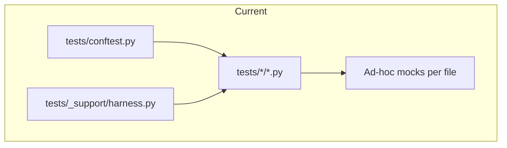

# Modular test scaffold plan

## Current state (pain points)

- **Single global** `[tests/conftest.py](tests/conftest.py)`: path fixtures + autouse `chdir` + **filename heuristics** in `pytest_collection_modifyitems` to assign `unit` / `integration` / `contract` / `live_smoke`. Adding a file can silently change its layer or misclassify it.
- **Fakes live in one file**: `[tests/_support/harness.py](tests/_support/harness.py)` defines `FakeGcsStore`, `FakeVmBackend`, `FakeGithubBackend`, but **fixtures are not centralized**—e.g. `[tests/ci/test_failure_fallback_status.py](tests/ci/test_failure_fallback_status.py)` defines `mock_github_api` / `mock_config` locally while other modules repeat similar `monkeypatch` patterns (`[tests/bmt/test_runtime_entrypoint.py](tests/bmt/test_runtime_entrypoint.py)`, `[tests/ci/test_workflow_dispatch.py](tests/ci/test_workflow_dispatch.py)`, etc.).
- **Repo-specific vs synthetic trees**: some tests build under `tmp_path` (good isolation); others bind to the real tree, e.g. `[tests/bmt/test_repo_sk_stage.py](tests/bmt/test_repo_sk_stage.py)` uses `repo_root / "gcp/stage"`, and `[tests/github/test_github_checks.py](tests/github/test_github_checks.py)` hardcodes `Path("gcp/stage/projects/sk/...")`. That coupling is **implicit**—hard to see what is “product contract” vs “this fork’s sample project.”
- **Heavy per-test capture types**: `[tests/bmt/test_runtime_github_reporting.py](tests/bmt/test_runtime_github_reporting.py)` defines many `_FooCapture` dataclasses inline; the pattern is clear but **not reusable** across files.
- **Naming**: `test_scaffolding.py` tests **CLI scaffold** (`tools.bmt.scaffold`), not “test infrastructure”—easy to confuse with pytest scaffolding.

## Target shape

### 1. Split `tests/support` into modules (keep `_support` as thin re-export or migrate in one PR)

| Module                              | Responsibility                                                                                                                                          |
| ----------------------------------- | ------------------------------------------------------------------------------------------------------------------------------------------------------- |
| `tests/support/fakes/gcs.py`        | `FakeGcsStore` (+ JSON types)                                                                                                                           |
| `tests/support/fakes/vm.py`         | `FakeVmBackend`, `VmDescribeStatus`, `VmMetadataCallRecord`                                                                                             |
| `tests/support/fakes/github.py`     | `FakeGithubBackend`                                                                                                                                     |
| `tests/support/fixtures/ci.py`      | Shared fixtures: `mock_github_api`, `mock_config` (move from `test_failure_fallback_status`), optional `patch_handoff_env`                              |
| `tests/support/fixtures/paths.py`   | `repo_root`, `gcp_code_root`, `github_bmt_root`, **new** `repo_stage_root` with docstring                                                               |
| `tests/support/fixtures/runtime.py` | Optional `minimal_execution_plan`, `tmp_stage_runtime` patterns for `gcp.image.runtime` tests                                                           |
| `tests/support/captures.py`         | Small generic `CallRecorder` / typed helpers for “capture last call to patched method” to dedupe `test_runtime_github_reporting` patterns (incremental) |
| `tests/support/testutils.py`        | Keep (or move) GITHUB_OUTPUT helpers from `[tests/_support/testutils.py](tests/_support/testutils.py)`                                                  |

**Principle:** *fakes are importable plain objects; fixtures only wire monkeypatch + env.*

### 2. Explicit markers and taxonomy (reduce magic filenames)

- Keep existing markers in `[pyproject.toml](pyproject.toml)` (`unit`, `contract`, `integration`, `live_smoke`).
- **Prefer explicit markers on tests or directories** over growing `pytest_collection_modifyitems` string lists. Options:
  - **A (recommended):** Add `tests/ci/conftest.py`, `tests/bmt/conftest.py`, etc., that `pytest_plugins` or define default markers for that subtree (e.g. all under `tests/ci/` get `integration` unless overridden).
  - **B:** Remove auto-assignment and require each test module to declare a module-level marker (noisy).
- Add **optional** markers for clarity: e.g. `uses_repo_stage` (tests that read real `gcp/stage/...`), `network` (if not using pytest-socket allowlists), so `pytest -m "not uses_repo_stage"` can run in stricter sandboxes.

### 3. Repo-specific policy (one place)

- Add `[tests/support/repo_policy.py](tests/support/repo_policy.py)` (or `constants.py`) with **named paths** only:
  - `SAMPLE_PROJECT = "sk"` (or from env `BMT_TEST_SAMPLE_PROJECT` defaulting to `sk`)
  - `sample_bmt_manifest(repo_root: Path) -> Path` returning the canonical example path under `gcp/stage/projects/...`
- Refactor tests that hardcode `sk` paths to use these helpers so **forks change one module** when they rename sample projects.
- Document in a short `[tests/README.md](tests/README.md)`: what is **fork-local** (stage sample project, CI vars) vs **framework** (`gcp.image.runtime`, `.github.bmt`).

### 4. Optional golden minimal stage tree

- For tests that only need *a* valid manifest, prefer **copying a tiny tree into `tmp_path`** (pattern already in `[tests/tools/test_bucket_sync_inputs_guard.py](tests/tools/test_bucket_sync_inputs_guard.py)`) or commit `**tests/fixtures/stage_minimal/**` (zip or few files) and unpack in fixtures—**reduces dependence on real `gcp/stage`** for unit/contract runs.

### 5. Clarify three different “mocks” (documentation)

| Concept              | Where                                          | Meaning                                |
| -------------------- | ---------------------------------------------- | -------------------------------------- |
| **Pytest doubles**   | `FakeGcsStore`, etc.                           | In-process, no I/O                     |
| **BMT mock runner**  | `BMT_USE_MOCK_RUNNER` / `plan.use_mock_runner` | Runtime skips real Kardome; not pytest |
| **Monkeypatched CI** | `mock_github_api`                              | Unit-test `.github.bmt` without GitHub |

A paragraph in `[tests/README.md](tests/README.md)` avoids conflating these.

### 6. Rename or clarify confusing tests

- Consider renaming `[tests/bmt/test_scaffolding.py](tests/bmt/test_scaffolding.py)` to `test_cli_scaffold_add_project.py` (or similar) so “scaffolding” means CLI, not test harness.

## Implementation order (incremental)

1. Add `tests/support/` package + move split fakes from `harness.py`; keep `tests/_support/harness.py` re-exporting for one release to avoid giant diffs.
2. Extract shared CI fixtures into `tests/support/fixtures/ci.py` and switch 2–3 highest-churn test files first.
3. Add `tests/README.md` + `repo_policy.py`; migrate 2–3 hardcoded `gcp/stage/projects/sk` references.
4. Introduce subdirectory `conftest.py` files to replace filename heuristics in root `conftest.py` (or narrow the heuristic to only `live_smoke`).
5. (Optional) Add `tests/fixtures/stage_minimal` + fixture for copy-on-demand.

## Out of scope (unless you want later)

- Splitting the `bmt` vs `gcp.image` packages for testing (large refactor).
- Auto-generating mocks from OpenAPI (overkill for this repo).

