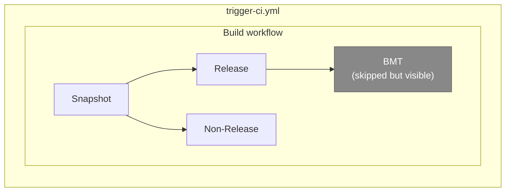

# Trigger CI DAG Options

## Current (broken UX)

Push to `ci/check-bmt-gate` shows the full `BMT` sub-graph as skipped grey nodes.



## Option A — Two trigger files (recommended)

### Push DAG (trigger-ci.yml)

```mermaid
flowchart LR
  subgraph trigger-ci.yml — push only
    subgraph Build [Build workflow]
      snap[Snapshot] --> rel[Release]
      snap --> nonrel[Non-Release]
    end
  end
```

### PR DAG (trigger-ci-pr.yml)

```mermaid
flowchart LR
  subgraph trigger-ci-pr.yml — PR only
    subgraph Build [Build workflow]
      snap[Snapshot] --> rel[Release]
      snap --> nonrel[Non-Release]
    end
    rel --> bmt[BMT]
  end
```

- Push: 3 jobs, no BMT node
- PR: 4 jobs, BMT always runs
- No skipped grey nodes ever

## Option B — Single trigger, BMT promoted to caller

```mermaid
flowchart LR
  subgraph trigger-ci.yml — push + PR
    subgraph Build [Build workflow]
      snap[Snapshot] --> rel[Release]
      snap --> nonrel[Non-Release]
    end
    rel -.->|"PR only"| bmt["BMT\n(skipped on push)"]
  end

  style bmt fill:#888,stroke:#666,color:#fff,stroke-dasharray: 5 5
```

- Push: 3 build jobs + 1 grey collapsed node
- PR: 3 build jobs + expanded BMT sub-graph
- Single file but still shows a skipped node on push
