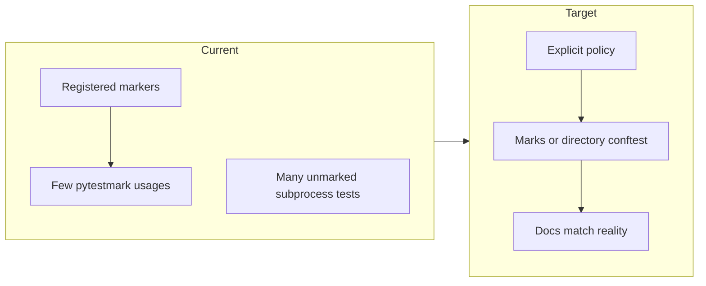

# Pytest design review and improvement plan

## Enhancement summary

**Deepened on:** 2026-03-22

**Sections enhanced:** Current state, marker taxonomy, duplicate coverage, negative/meta-tests, exception assertions, CLI testing, dead fixtures, dependency hygiene, CI recipes, implementation order.

**Research sources:** Pytest stable docs (markers, warnings/filterwarnings), general 2024–2026 pytest best-practice summaries, readonly kieran-python-reviewer pass, prior codebase review. `docs/solutions/` is not present in this repo—no institutional learnings merged.

### Key improvements captured

1. **Hybrid CLI strategy:** Prefer `CliRunner` on `[tools/__main__.py](tools/__main__.py)` `app` (import `main` pattern or expose `app` via a tiny test-only hook); retain **one** subprocess smoke for `python -m tools` if entrypoint packaging must be guarded.
2. **Stable meta-tests:** Prefer `pytest.main([...])` return code plus hook plugins or `pytester` (if added as dev dep) over parsing `"5 xfailed"` from human stdout.
3. **Marker honesty:** Under `--strict-markers`, unused registered markers are tech debt; either apply `unit` broadly, remove it from registry, or document it as reserved for external workflows only.
4. **Warnings as quality gate:** Optional `[tool.pytest.ini_options] filterwarnings` to escalate selected warnings to errors ([pytest docs — filterwarnings](https://docs.pytest.org/en/stable/how-to/capture-warnings.html)).
5. `**publish_bmt` exceptions:** Failure path goes through `validate_workspace_plugin` → `load_plugin`; narrow assertions to the **actual** exception type(s) that chain produces (e.g. `SyntaxError` from invalid Python, or wrapper from loader)—inspect `gcp/image/runtime/plugin_loader.py` when implementing.

### New considerations

- **AAA pattern** (Arrange–Act–Assert) and **test independence** remain standard guidance for new tests ([orchestrator.dev summary](https://orchestrator.dev/blog/2024-12-21-python-testing-best-practices)).
- **Fixture scope:** Session fixtures for immutable paths are appropriate; avoid widening scope for mutable state without explicit reset ([pytest fixture docs](https://docs.pytest.org/en/stable/how-to/fixtures.html)).
- `**@pytest.mark.filterwarnings`:** Module-level `pytestmark` can turn warnings into errors for specific high-signal modules without global breakage.

---

## Current state (strengths)

- **Modern baseline**: [pyproject.toml](pyproject.toml) pins `pytest>=9.0.2` with `minversion = "9.0"`, `--strict-config --strict-markers`, and a useful plugin set (`pytest-timeout`, `pytest-xdist`, `pytest-randomly`, `pytest-socket`, `pytest-subprocess`, `pytest-mock`, `pytest-github-actions-annotate-failures`).
- **Shared fixtures**: Session-scoped path fixtures in [tests/support/fixtures/paths.py](tests/support/fixtures/paths.py), re-exported from [tests/conftest.py](tests/conftest.py), keep repo-relative behavior stable via autouse `chdir` to `repo_root`.
- **Layering docs**: [tests/README.md](tests/README.md) explains fakes vs mocks vs mock-runner and how to run subsets.
- **Strong examples**: [tests/bmt/test_stage_bmt_manifests.py](tests/bmt/test_stage_bmt_manifests.py) uses discovery + parametrization + guard test + optional marks (`bmt_plugin_load`, `integration`) in a way that scales with the stage tree.

### Research insights

**Best practices**

- Register every custom marker in `pyproject.toml` and use `-m` for selective runs; document marker semantics so `not slow` / `unit` expressions stay unambiguous ([pytest marker examples](https://docs.pytest.org/en/latest/example/markers.html)).
- Prefer **one observable behavior per test**; parametrization over copy-paste for matrix cases (already used well in stage BMT manifests).

**Performance**

- Session-scoped `repo_root` avoids repeated filesystem probes; keep autouse `chdir` cost negligible vs subprocess-heavy tests.

---

## Gaps and risks

### 1. Marker taxonomy vs reality

- Registered markers include `unit`, but **nothing under `tests/` uses `@pytest.mark.unit` or `pytestmark = pytest.mark.unit`** (verified by search). Running `-m unit` as documented in [tests/README.md](tests/README.md) would collect **zero** tests.
- [tests/conftest.py](tests/conftest.py) says subdirectory conftests assign markers; [tests/bmt/conftest.py](tests/bmt/conftest.py) and [tests/ci/conftest.py](tests/ci/conftest.py) are effectively empty, so that story is not implemented.
- [tests/tools/test_cli_entry.py](tests/tools/test_cli_entry.py) runs multiple `subprocess.run` help smokes but has **no** `integration`/`contract` mark, while [tests/README.md](tests/README.md) only lists three marked files—so docs understate subprocess usage.

**Direction**: Pick one policy and make it true in code + docs:

- **Option A — Explicit marks**: Add `pytestmark` (or per-test marks) to every module that does subprocess / heavy FS, and expand the README table.
- **Option B — Directory defaults**: Implement real `pytestmark` in `tests/tools/conftest.py`, `tests/ci/conftest.py`, etc., with narrow overrides for pure unit files.

### Research insights

**Best practices**

- **Do not register markers that nothing uses** unless they are a documented contract for CI matrices or external plugins; under `--strict-markers`, dead registry entries invite confusion and false confidence.
- If `unit` is kept: add `pytestmark = pytest.mark.unit` at the top of pure modules *or* use a `tests/unit/` tree with a single conftest that applies the mark by default.

**Edge cases**

- Combining `-m unit` with `-m integration` requires boolean docs (`and` / `or`); pytest’s `-m` uses eval-like expressions—document safe examples in [tests/README.md](tests/README.md).

---

### 2. Duplicate `sanitize_run_id` coverage

`[ci.core](.github/bmt/ci/core.py)` imports `sanitize_run_id` from `[gcp.image.config.value_types](gcp/image/config/value_types.py)`. [tests/ci/test_ci_models.py](tests/ci/test_ci_models.py) and [tests/gcp/test_value_types.py](tests/gcp/test_value_types.py) repeat the same cases; [test_value_types.py](tests/gcp/test_value_types.py) is stricter (`pytest.raises(..., match="empty")`) while [test_ci_models.py](tests/ci/test_ci_models.py) only checks `ValueError` without `match`.

**Direction**: Keep behavioral coverage in **one place** (`value_types`). For the CI package, either drop duplicate tests or add a **single** test that the re-export is the same object (`assert models.sanitize_run_id is sanitize_run_id`).

### Research insights

**Implementation details**

```python
from gcp.image.config import value_types as vt
from ci import core as models

def test_ci_reexports_sanitize_run_id() -> None:
    assert models.sanitize_run_id is vt.sanitize_run_id
```

**Anti-patterns**

- Duplicating parametrized cases in two modules doubles maintenance and allows `match=` drift.

---

### 3. Negative / meta-tests: `xfail` + subprocess parsing

[tests/ci/test_ci_commands_negative.py](tests/ci/test_ci_commands_negative.py) uses `xfail(strict=True)` to prove “our positive tests would fail,” plus [test_negative_tests_run_and_verify_xfails](tests/ci/test_ci_commands_negative.py) that shells out to pytest and asserts on substrings like `"5 xfailed"`. That is sensitive to **pytest version output**, verbosity, plugins, and **xdist** summary formatting. The `or "xpassed" not in result.stdout` branch is also logically weak (can pass without the expected count).

**Direction** (pick one, in order of robustness):

- **Best**: Extract matrix/JSON validation into **pure functions** (or call existing helpers) and assert with `pytest.raises` / structured failures—no `xfail` circus.
- **Medium**: Replace stdout scraping with `**pytest.main([...])`** return value and/or a **custom plugin** (`pytest_runtest_logreport`) to count expected failures, or use `**pytester`** (requires adding `pytest`’s test support as a dev dependency in controlled scope)—avoid depending on human-readable summary lines ([pytest API](https://docs.pytest.org/en/stable/reference/reference.html#pytest-main)).
- **Minimum**: If keeping subprocess, assert on **stable** fragments only after pinning output (`-q` / `--no-header`), and fix the boolean logic so the count is mandatory.

### Research insights

**Best practices**

- Treat **pytest console output as unstable API**; reserve stdout assertions for smoke tests with explicit version pinning comments.
- `**pytest.main`**: Returns an exit code (`0` success, `1` tests failed, etc.); combine with a temp directory and minimal test files for controlled behavior without nested full-suite runs.

**Edge cases**

- **xdist** changes ordering and sometimes summary layout; meta-tests should run with `PYTEST_ADDOPTS` cleared or documented flags.

---

### 4. Over-broad exception assertions

[tests/bmt/test_plugin_publish.py](tests/bmt/test_plugin_publish.py) uses `pytest.raises(Exception)` for invalid workspace plugin code—too broad for regression safety.

**Direction**: Assert the **concrete** exception type (and `match=`) that `publish_bmt` is contractually expected to raise after a syntax error in the workspace plugin. `[publish_bmt](tools/bmt/publisher.py)` calls `validate_workspace_plugin` → `load_plugin`; invalid Python typically surfaces as `**SyntaxError`** or an import/loader error from `[load_plugin](gcp/image/runtime/plugin_loader.py)`—confirm at implementation time and assert **that** type, not `Exception`.

### Research insights

**Best practices**

- Use `pytest.raises(SyntaxError, match=...)` or `pytest.raises(PluginLoadError, ...)` if the loader wraps failures—align with production error handling.
- Avoid catching `BaseException` or bare `Exception` in tests unless asserting “anything but SystemExit.”

---

### 5. In-process vs subprocess CLI tests

[tests/tools/test_build_cmd.py](tests/tools/test_build_cmd.py) and [tests/tools/test_pulumi_cmd.py](tests/tools/test_pulumi_cmd.py) already use **Typer `CliRunner`**. [tests/tools/test_cli_entry.py](tests/tools/test_cli_entry.py) uses **subprocess** for `-m tools --help` trees—slower, harder to debug, and inconsistent.

**Direction**:

- **Default**: Use `CliRunner` against the root Typer app. Today `[tools/__main__.py](tools/__main__.py)` builds `app` inside `main()` only; **refactor minimally** so tests can import `app` (e.g. move Typer construction to module level or add `get_app()` used by both `main()` and tests)—then mirror [tests/tools/test_build_cmd.py](tests/tools/test_build_cmd.py) patterns.
- **Optional thin subprocess**: Keep **one** `subprocess.run([sys.executable, "-m", "tools", "--help"], ...)` test if the team wants confidence in `python -m tools` / packaging entrypoints—document it as “wiring smoke,” not behavior-heavy.

### Research insights

**Performance**

- CliRunner avoids process spawn per case; large speedups when expanding help coverage.

**Edge cases**

- Rich markup in help text: CliRunner output should still contain expected substrings; if Rich wraps output differently than TTY, prefer asserting on **stable** keywords (`add-project`, `deploy`) rather than full formatting.

---

### 6. Dead or misleading fixtures

[tests/conftest.py](tests/conftest.py) `_reset_bmt_config_cache` is a **no-op** with a comment about isolation—future readers may assume resets happen.

**Direction**: Remove the fixture or implement real cache clearing when `ci.config` (or similar) gains caching.

### Research insights

**Anti-patterns**

- Autouse fixtures that silently do nothing undermine trust—prefer delete or a one-line `pytest.warns` if keeping a stub during transition (usually overkill; deletion is clearer).

---

### 7. Dependency hygiene

- `**pytest-mock`**: Listed in [pyproject.toml](pyproject.toml) but the suite predominantly uses `monkeypatch` / `unittest.mock`. Either adopt `mocker` where it reduces boilerplate or drop the dependency to reduce surface area.
- `**pytest-socket`**: Ensure policy is documented (default deny vs allowlist) so contributors know why network calls fail in tests.

### Research insights

**Best practices**

- `**pytest-mock`**: The `mocker` fixture auto-undoes patches; valuable for nested `patch` stacks—use-or-drop is correct.
- **Warnings**: Consider `[tool.pytest.ini_options] filterwarnings` for gradual “warnings as errors” on owned code paths ([docs](https://docs.pytest.org/en/stable/how-to/capture-warnings.html)).

---

### 8. CI / local recipes

[Justfile](Justfile) `test` runs `uv run python -m pytest tests/ -v` with no `-n auto`. Parallel runs are optional but worth documenting tradeoffs with `pytest-randomly` and ordering-sensitive tests.

### Research insights

**Performance**

- **xdist** `-n auto`: Good for CPU-bound pure tests; can interact badly with shared session fixtures that assume single process (your path fixtures are read-only—generally safe). Document a canonical CI command.
- **pytest-randomly**: Surfaces order dependence; if a test fails only under random order, fix the test rather than pinning seed long-term.

**References**

- [Pytest: capturing warnings](https://docs.pytest.org/en/stable/how-to/capture-warnings.html)
- [Pytest: working with custom markers](https://docs.pytest.org/en/latest/example/markers.html)

---

## Suggested implementation order

1. **Truth in docs**: Fix [tests/README.md](tests/README.md) vs actual marks (`unit` story, list of subprocess modules, subdirectory conftest claims).
2. **Quick wins**: Narrow `pytest.raises` in plugin publish tests; consolidate `sanitize_run_id` tests.
3. **Reliability**: Redesign negative/matrix validation tests away from `xfail` + stdout parsing.
4. **Consistency**: Mark or default-mark subprocess-heavy modules; align CLI help tests on `CliRunner` where possible (refactor `tools/__main__.py` for importable `app` if needed).
5. **Cleanup**: No-op `_reset_bmt_config_cache`; `pytest-mock` use-or-drop.
6. **Optional**: `filterwarnings` policy; document xdist / randomly / CI invocation.




---

**Canonical copies:** Cursor plan `pytest_suite_hardening_fb3eeada.plan.md` and repo mirror `[docs/superpowers/plans/2026-03-22-pytest-suite-hardening.md](docs/superpowers/plans/2026-03-22-pytest-suite-hardening.md)` — keep in sync when editing.
