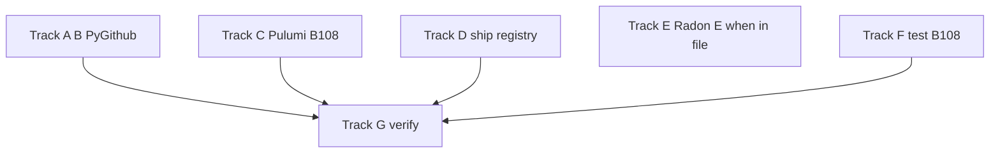

# Security, ship semantics, and quality remediation

> **For agentic workers:** Implement by **priority** (P1 → P5). Use checkbox subtasks in each track; commit after each track or logical slice.

**Goal:** Close **Bandit B310** on GitHub paths via **PyGithub**, fix **B108** in infra/tests, correct **ship** image auto-skip when Artifact Registry is unavailable or mis-permissioned, and schedule **Radon E** refactors without blocking security work.

**Architecture:** PyGithub in [gcp/image/pyproject.toml](gcp/image/pyproject.toml) for **bmt-runtime**; shared patterns with [.github/bmt/ci/github.py](.github/bmt/ci/github.py). Ship logic returns explicit **probe results** (`present` / `absent` / `unavailable` / `permission_denied`) so [tools/cli/ship_cmd.py](tools/cli/ship_cmd.py) can **fail-open** (run `just image`) or surface errors. Pulumi uses **stdlib `tempfile`** instead of string `/tmp`.

**Tech stack:** Python 3.12, PyGithub 2.x, `google-cloud-artifact-registry`, Typer/Rich ship UI.

**py-refactor alignment:** Treat **P1–P2** as **critical/high** (security + operational correctness). Run `**uvx bandit -r … -ll`** after P1/P2. Defer **Radon E** until you are already editing those modules (medium). **py-code-health:** after substantive edits, optionally run `vulture . --min-confidence 80` (exclude `venv`) and `pylint --disable=all --enable=duplicate-code` on touched trees — only consolidate duplicates if you introduce parallel PyGithub helpers (extract shared thin wrapper to avoid copy-paste).

**Save a repo copy to:** [docs/superpowers/plans/2026-03-23-security-ship-quality-remediation.md](docs/superpowers/plans/2026-03-23-security-ship-quality-remediation.md) when executing (create `docs/superpowers/plans/` if missing).

---

## Issues restated (urgency order)

### 1. Highest urgency (security / untrusted input in real code paths)

| Priority | What                                                                                                                                                                                | Why                                                                                                          |
| -------- | ----------------------------------------------------------------------------------------------------------------------------------------------------------------------------------- | ------------------------------------------------------------------------------------------------------------ |
| **1a**   | **B310** `urllib.request.urlopen` — [gcp/image/github/github_auth.py](gcp/image/github/github_auth.py) (~~128), [gcp/image/github/statuses.py](gcp/image/github/statuses.py) (~~50) | Cloud Run runtime; replace with **PyGithub** so requests go through a maintained client (no raw `urlopen`).  |
| **1b**   | **B310** — [tools/repo/gh_app_perms.py](tools/repo/gh_app_perms.py) (~71)                                                                                                           | Dev tooling hitting real endpoints; same fix — **PyGithub** App auth for `GET /app` equivalent.              |
| **1c**   | Raw **httpx** REST — [gcp/image/github/github_checks.py](gcp/image/github/github_checks.py)                                                                                         | Same theme as 1a; migrate **create/update check run** to PyGithub for consistency and fewer hand-built URLs. |

### 2. High urgency (infra / non-test smell / operational correctness)

| Priority | What                                                                                                                                                   | Why                                                                                                                                                   |
| -------- | ------------------------------------------------------------------------------------------------------------------------------------------------------ | ----------------------------------------------------------------------------------------------------------------------------------------------------- |
| **2a**   | **B108** hardcoded temp — [infra/pulumi/**main**.py](infra/pulumi/__main__.py) (~82)                                                                   | Use `**tempfile`** APIs; `/tmp` literals are wrong on some runners.                                                                                   |
| **2b**   | **Ship:** `artifact_registry_tag_status == "unavailable"` still auto-skips — [tools/cli/ship_cmd.py](tools/cli/ship_cmd.py)                            | If registry check fails, **do not** treat like “safe to skip”; **run `just image`** or exit with a clear message (fail-open for skip).                |
| **2c**   | **PermissionDenied** lumped into `GoogleAPICallError` → `unavailable` — [tools/shared/artifact_registry_uri.py](tools/shared/artifact_registry_uri.py) | Surface `**permission_denied`** (or raise with IAM hint) separately from `**absent**` and `**unavailable_transient**` so misconfiguration is obvious. |

### 3. Medium urgency (maintainability / change risk — Radon E)

| Priority | What                                                                                           | Metric      |
| -------- | ---------------------------------------------------------------------------------------------- | ----------- |
| **3a**   | [tools/repo/gh_repo_vars.py](tools/repo/gh_repo_vars.py) — `GhRepoVars._build_diff`            | E (39)      |
| **3b**   | [tools/pulumi/pulumi_apply.py](tools/pulumi/pulumi_apply.py) — `main`                          | E (37)      |
| **3c**   | [tools/repo/gcp_layout_policy.py](tools/repo/gcp_layout_policy.py) — `GcpLayoutPolicy` / `run` | E (34 / 33) |

**D-grade** examples (refactor **when touching**): `GhRepoVars._apply`, `_load_contract`, `symlink_bmt_deps.run`, HandoffEnv / handoff helpers, `RunnerManager` upload paths, etc.

### 4. Lower urgency (tests only — Bandit B108)

| What                                                                                                                                                                                                                                                  | Notes                                                                                         |
| ----------------------------------------------------------------------------------------------------------------------------------------------------------------------------------------------------------------------------------------------------- | --------------------------------------------------------------------------------------------- |
| [tests/bmt/test_sk_plugin_batch_json.py](tests/bmt/test_sk_plugin_batch_json.py), [tests/bmt/test_sk_scoring_policy.py](tests/bmt/test_sk_scoring_policy.py), [tests/tools/test_github_app_settings.py](tests/tools/test_github_app_settings.py) (2×) | Prefer `**tmp_path`**; or `# nosec B108` + one-line rationale for intentional `/tmp` strings. |

### 5. Background / hygiene (not blocking the above)

| What                                                                   | Notes                                                                                                                                                                                  |
| ---------------------------------------------------------------------- | -------------------------------------------------------------------------------------------------------------------------------------------------------------------------------------- |
| Many **Radon C** across `gcp/image/runtime`, `tools`, `.github/bmt/ci` | Pay down when editing those modules.                                                                                                                                                   |
| **Wily**                                                               | Trend only; `uvx wily build` on a clean tree — not a defect backlog.                                                                                                                   |
| **Dockerfile** base tags vs digests; Cloud Run `:latest` vs digest     | Supply-chain / reproducibility per [docs/brainstorms/2026-03-23-container-image-identity-ship-brainstorm.md](docs/brainstorms/2026-03-23-container-image-identity-ship-brainstorm.md). |

---

## File map (create / modify)

| File                                                                           | Role                                                                                                                          |
| ------------------------------------------------------------------------------ | ----------------------------------------------------------------------------------------------------------------------------- |
| [gcp/image/pyproject.toml](gcp/image/pyproject.toml)                           | Add `PyGithub>=2.0`.                                                                                                          |
| [gcp/image/github/github_auth.py](gcp/image/github/github_auth.py)             | PyGithub installation token; remove `urllib` for token exchange.                                                              |
| [gcp/image/github/statuses.py](gcp/image/github/statuses.py)                   | `create_status` via PyGithub.                                                                                                 |
| [gcp/image/github/github_checks.py](gcp/image/github/github_checks.py)         | Check runs via PyGithub; drop raw `httpx` to `api.github.com`.                                                                |
| [tools/repo/gh_app_perms.py](tools/repo/gh_app_perms.py)                       | App metadata via PyGithub.                                                                                                    |
| [infra/pulumi/**main**.py](infra/pulumi/__main__.py)                           | **2a:** `tempfile` instead of `/tmp` string.                                                                                  |
| [tools/shared/artifact_registry_uri.py](tools/shared/artifact_registry_uri.py) | **2c:** extend return type / exceptions for `PermissionDenied` vs generic API errors.                                         |
| [tools/cli/ship_cmd.py](tools/cli/ship_cmd.py)                                 | **2b:** if `permission_denied` → error panel / non-skip; if `unavailable` (non-perm) → prefer **run image** over silent skip. |
| Tests under `tests/bmt/`, `tests/gcp/`, `tests/tools/`                         | Mock PyGithub; **Track F** tmp_path; new tests for ship probe branches.                                                       |
| [pyproject.toml](pyproject.toml) (root)                                        | Only if `tools` runs without transitive PyGithub — add explicit dep after `uv tree` check.                                    |

---

### Track A — P1 B310 / PyGithub

- Add `PyGithub>=2.0` to [gcp/image/pyproject.toml](gcp/image/pyproject.toml); `uv lock` / `uv sync`; `uv run --package bmt-runtime python -c "import github"`.
- [github_auth.py](gcp/image/github/github_auth.py): installation access token via **GithubIntegration** (or documented 2.x equivalent); preserve `str | None` + logging on failure.
- [statuses.py](gcp/image/github/statuses.py): `repo.get_commit(sha).create_status(...)` like [.github/bmt/ci/github.py](.github/bmt/ci/github.py).
- [gh_app_perms.py](tools/repo/gh_app_perms.py): PyGithub for app metadata; remove `urlopen`.
- Unit tests: mock PyGithub; no `urllib.request.urlopen` in these paths.

### Track B — P1 check runs PyGithub

- [github_checks.py](gcp/image/github/github_checks.py): `create_check_run` / `update_check_run` via PyGithub `Repository` APIs; keep `_normalize_check_output` / UTF-8 clamp.
- Tests: assert no `httpx.post`/`patch` to `check-runs` in this module.

### Track C — P2a Pulumi B108

- [infra/pulumi/**main**.py](infra/pulumi/__main__.py): replace hardcoded temp path with `tempfile.TemporaryDirectory` or `mkstemp` + explicit cleanup appropriate for Pulumi preview/up context.
- Re-run `bandit` on `infra/pulumi` to confirm B108 cleared for that line.

### Track D — P2b/P2c ship + registry

- [artifact_registry_uri.py](tools/shared/artifact_registry_uri.py): catch `**google.api_core.exceptions.PermissionDenied`** (or `Forbidden`) separately; return e.g. `**permission_denied**` or raise a typed error; keep `**NotFound` → absent**; optional `**unavailable_transient`** for retryable `GoogleAPICallError` after retries (optional `google.api_core.retry.Retry` for `UNAVAILABLE`).
- [ship_cmd.py](tools/cli/ship_cmd.py): `**present**` → skip image; `**absent**` → run image; `**permission_denied**` → print clear Rich error (IAM / `roles/artifactregistry.reader`) and **do not** git-only skip; `**unavailable`** (other) → **run `just image`** (fail-open) or Typer exit **non-zero** with message — pick one policy and document in `--help`.
- Tests: mock `artifact_registry_tag_status` or client; cover skip vs build vs error branches.

### Track E — P3 Radon E

- **Do not block** Tracks A–D. When editing a file anyway, extract helpers / guard clauses on `**GhRepoVars._build_diff`**, `**pulumi_apply.main**`, `**GcpLayoutPolicy.run**` (and related E/D symbols).
- After each refactor: `uv run pytest` on affected areas; optional `uvx radon cc <file> -n C -s` to confirm local improvement.

### Track F — P4 test B108

- Convert `/tmp` string fixtures to `**tmp_path**` where trivial.
- Else `**# nosec B108**` with rationale (test-only fake path).

### Track G — Verification

- `uv run ruff check` / `uv run ty check` on changed paths.
- `uv run python -m pytest` (GitHub + ship + artifact_registry tests).
- `uvx bandit -r gcp/image tools/repo/gh_app_perms.py tools/cli/ship_cmd.py tools/shared/artifact_registry_uri.py infra/pulumi -ll` — expect **no B310** on migrated GitHub code; **B108** addressed per tracks C/F.
- Optional **py-code-health:** `vulture . --min-confidence 80` (with excludes for `venv`, `.venv`, `gcp/stage`); `pylint --disable=all --enable=duplicate-code --duplicate-code-min-lines=6` on `gcp/image/github` if duplication appears after PyGithub extraction.
- `just image` or CI image build after `bmt-runtime` dep change.

---

## Risks

- **PyGithub** minor API differences — lock behavior with tests against resolved version in `uv.lock`.
- **Ship fail-open** may increase build frequency when offline — document `**--skip-image`** / `**--force-image**` for escape hatches.

---

## Execution options

1. **Sequential by track** — A → B → C → D → F → G, then E opportunistically.
2. **Parallel branches** — C + D in one PR while A + B in another (merge conflict risk in lockfile — prefer single PR or rebase discipline).

