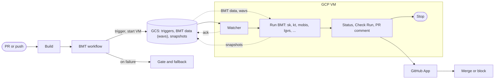

**Update to the PR description above:** Design and structure have evolved. Below: changelog, flow, features, edge cases, and QoL key, and to-dos.

**Changelog** — Trigger: `pull_request`, branches dev/ci/check-bmt-gate/test/*; concurrency per-branch, cancel-in-progress. Checkout: single → repo-snapshot artifact. Presets: sparse `CMakePresets.json`. Build: build-release (BMT path) + build-nonrelease (parallel). BMT: prepare → upload-runners → handoff (classify → run); Gate always runs, fallback on failure; optional VM pool. GCS: pointer at `current.json`, snapshots under `snapshots/<run_id>/`.

## Flow (current)

**Legend:** ✓ = implemented | ✗ = not implemented | ◐ = solved/simplified by Cloud Run Jobs

| Feature / edge case | Status | CRJ |
|--------------------|--------|-----|
| **Trigger & build** | | |
| Trigger on PR/push (branch filters, concurrency) | ✓ | — |
| Build release (BMT path) + non-release (parallel) | ✓ | — |
| Path filters (skip when only docs or CI changed) | ✗ | — |
| **BMT workflow** | | |
| Prepare → upload-runners → handoff (classify → run) | ✓ | — |
| Gate + Fallback | ✓ | — |
| **GCS** | | |
| Triggers, ack, BMT data (wavs), snapshots, pointer | ✓ | — |
| **VM** | | |
| Watcher → Run BMT (matrix sk, kt, …) → Post → Stop | ✓ | ◐ |
| Handoff gating (dev/ci, same-repo) | ✓ | — |
| **GitHub** | | |
| Commit status (BMT Gate) | ✓ | — |
| Check Run | ✓ | — |
| PR comment with results | ✓ | — |
| **Edge cases** | | |
| Prepare fail → Fallback | ✓ | — |
| upload-runners (continue on error) | ✓ | — |
| Classify (no jobs to run) → fail | ✓ | — |
| VM pool full | ✓ | ◐ |
| Pending triggers (another run in progress) | ✓ | ◐ |
| VM response timeout | ✓ | ◐ |
| VM stops after run | ✓ | ◐ |
| **QoL** | | |
| Concurrency cancel-in-progress (per branch) | ✓ | — |
| Single checkout / repo-snapshot artifact | ✓ | — |
| Sparse CMakePresets.json (BMT path only) | ✓ | — |
| Optional VM pool (multiple VM names) | ✓ | ◐ |
| Handshake guidance + timeout diagnostics | ✓ | — |
| Repo vars check/apply, validate-vm-vars | ✓ | — |
| Sync/verify-sync, show-env (devtools) | ✓ | — |

**To-dos** *(workflow-optimizations merged)* — (1) Cloud Run Jobs: full parallelism, no pool/queuing/self-stop. (2) Path filters / conditionals: run build and BMT only when application code or build config changed; skip for docs- or CI-only changes.

**Cloud Run Jobs (CRJ) — compatibility**

- **What CRJ does:** Runs batch tasks to completion and exits (no serving). One job execution per workflow run → full parallelism across PRs; no VM pool, no “pending triggers” blocking, no VM start/stop/stabilization or self-stop logic. Env vars (and Secret Manager) at execute time; task timeout up to 7 days; pay per execution time. Fits the existing trigger/ack/handshake flow (workflow writes trigger, executes job, waits for ack).
- **What CRJ cannot do:** Does not remove the need for GCS (triggers, ack, snapshots, BMT data), path filters, or gate/fallback logic. Quotas: max 1000 concurrent job executions and 1000 jobs per project/region (non-increasable); max 32 GiB memory and 8 vCPU per task; 4‑minute container startup timeout; execution history limited to last 1000 or 7 days. Concurrent runs require generation-based CAS on `current.json` (not needed with a single VM). Known issue: tasks can be spuriously marked as retried — use `--max-retries` ≥ 3.
